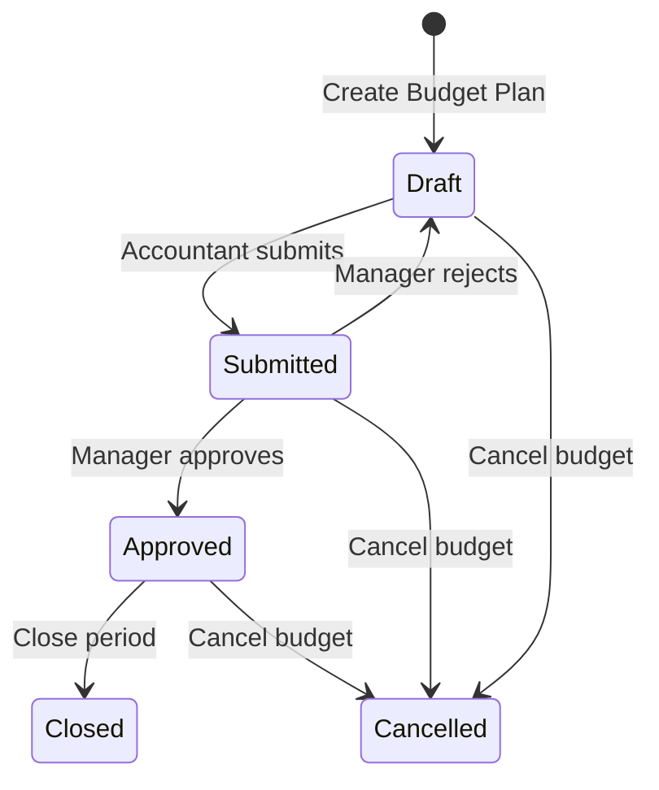
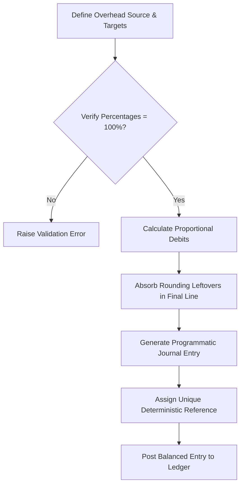

# Cost Center & Budget Control

An Odoo 18 Community Edition module for cost center hierarchy management, budget control validation, and department-level cost allocation.

---

## Short Project Summary
This module implements department-level budget planning and cost allocation workflows within Odoo 18. It provides real-time budget utilization tracking using Odoo's analytic accounting lines, automated journal entry generation for cost distribution, and configurable threshold validation to prevent budget overruns during account move posting.

Designed for organizations requiring strict financial discipline, the module extends Odoo’s native accounting capabilities with robust ledger controls, multi-company safety protections, and state-driven workflow lifecycle controls.

---

## Business Context
Standard Odoo analytic accounting excels at cost tracking but lacks native mechanisms to enforce department-level budget limits before overspending occurs. Managers are often forced to rely on retroactive reports, which only highlight budget overruns after transactions are posted.

This module addresses this control gap by validating transactions in real time during the posting workflow. It ensures that expenditures are checked against approved departmental budget limits before finalizing entries. Furthermore, it simplifies administrative overhead by programmatically distributing shared expenses across departments using clear, balanced, and traceable ledger transactions.

---

## Technical Scope
- **Platform**: Odoo 18.0 Community Edition
- **Database**: PostgreSQL (JSONB queries & index structures)
- **Language**: Python 3
- **Odoo Mechanisms**: Native Accounting Engine inheritance, Analytic Account Lines (`account.analytic.line`), Analytic Distribution framework, and Multi-Company isolation logic.

---

## Core Features
- **Hierarchical Cost Centers**: Parent-child organizational structures linked with company-specific analytic accounts.
- **Workflow-Driven Budget Plans**: State-protected budget cycles (Draft → Submitted → Approved → Closed/Cancelled) enforcing clear workflow transitions and locking finalized plans against changes.
- **Analytic Line Aggregation**: Real-time computation of actual expenditures directly from analytic distributions and legacy analytic accounts.
- **Programmatic Cost Allocation**: Balanced ledger adjustments transferring costs from overhead pools to target cost centers using defined percentage rules.
- **Budget Threshold Validation**: Warning, critical, and blocking controls triggered automatically during journal entry posting.
- **Role-Based Overrides**: Structured security permissions enabling authorized managers to post transactions exceeding blocking limits when business justifications exist.

---

## Architectural Pillars

### 1. Data Integrity & Immutability
To protect historical records and prevent accidental modifications, the module enforces structural immutability on budget plans. Once a plan reaches an approved, closed, or cancelled status, its definitions and budget lines are locked. Any attempts to modify or delete these records are blocked at the ORM layer.

### 2. Workflow Discipline & Governance
Budget cycles are governed by a state machine that dictates exactly who can execute transitions and when. For example, transition from a draft status to an active or approved status requires authorization from designated managers. This establishes strong internal controls and audit trails before budgets become active.

### 3. Ledger Accuracy & Traceability
The cost allocation engine guarantees absolute bookkeeping accuracy. All programmatically generated ledger entries are perfectly balanced; any rounding residuals are automatically absorbed by the final target allocation line to ensure total debits exactly equal credits. Traceable, idempotent allocation references are generated to eliminate duplicate allocations.

### 4. Strict Multi-Company Safety
Multi-company operations require strict isolation. The module enforces boundary separation at the ORM layer using company-aware validation. Cross-company accounting references are blocked, ensuring that budget plans, cost centers, and journals are isolated to the active company context.

### 5. Proactive Budget Validation
Instead of retroactive reporting, the module performs integrated validation within posting workflows. Intercepting standard transaction posting, it evaluates projected expenditures against remaining budget balances. If a transaction causes an overrun in blocking mode, it halts the operation and requests authorization from an Override Manager.

---

## User-Oriented Workflow Overview

### 1. Budget Lifecycle
1. **Planning**: An accountant creates a new budget plan in `Draft` status for a specific cost center and period, adding projected line-item expenses.
2. **Review**: The accountant submits the budget for approval, shifting it to `Submitted` status, which restricts edits to Budget Managers.
3. **Activation**: The Budget Manager reviews the allocations and clicks **Approve**, locking the budget plan definitions and transitioning it to `Approved` status.
4. **Operations**: As Odoo postings match the cost center's analytic account and expense accounts, the system aggregates actual expenditures in real time.
5. **Closure**: Once the period is complete, the budget plan is marked as `Closed` or `Cancelled` for historical record retention.



### 2. Cost Allocation Workflow
1. **Rule Setup**: A manager defines the source cost center (the overhead pool), target cost centers, and target allocation percentages.
2. **Verification**: The system verifies that target percentages sum to exactly 100%.
3. **Execution**: The manager triggers the allocation process. The system calculates proportional values, absorbing any rounding leftovers into the final target cost center line.
4. **Ledger Posting**: The system programmatically generates and posts a balanced journal entry (`account.move`), debiting target cost centers and crediting the source cost center, while applying standard analytic distributions.
5. **Idempotency Safeguard**: The transaction is marked with a deterministic unique reference key. If the process is run again for the same period and pool, the system identifies the existing entry and prevents duplicate posting.



### 3. Budget Threshold Validation Flow
1. **Transaction Capture**: An accountant posts a vendor bill or journal entry containing analytic accounts linked to monitored cost centers.
2. **Live Budget Check**: Odoo intercepts the posting workflow to compute the total projected actual expenditure against the relevant budget plan line.
3. **Threshold Assessment**:
   - **Under 70%**: Post proceeds normally.
   - **70% to 90% (Warning)**: Posting completes, but a warning message is logged directly in the document's chatter.
   - **90% to 100% (Critical)**: Posting completes, chatter warning is logged, and Odoo automatically schedules an activity alert for the Budget Manager.
   - **Over 100% (Exceeded)**: If blocking mode is active, the transaction fails and raises an error dialog unless the context includes an Override Manager's security token.

---

## Installation & Quick Start

### Prerequisites
- Docker and Docker Compose installed.
- Git client.

### Quick Start
To spin up the PostgreSQL database and Odoo instance with the cost center and budget control module pre-mounted:

```bash
# Clone the repository
git clone https://github.com/jaizyikhwan/odoo18-cost-center.git
cd odoo18-cost-center

# Launch the containerized ecosystem
docker compose up -d

# Check startup logs
docker compose logs -f odoo
```

Once Odoo has completed initialization, navigate to `http://localhost:8018` in your browser. Install the **Cost Center & Budget Control** (`cost_center_budget_control`) app from the Odoo Apps dashboard.

*Note: The mounted `addons/` volume allows real-time local file changes to be reflected immediately in Odoo on upgrade.*

---

## Repository Structure Overview

```
odoo-cost-center/
├── addons/
│   └── cost_center_budget_control/
│       ├── __init__.py
│       ├── __manifest__.py
│       ├── controllers/                   # Web controllers (placeholders for extension)
│       ├── models/                        # Python model logic
│       │   ├── cost_center.py             # Hierarchical cost centers
│       │   ├── budget_plan.py             # Budget plans & transactional actual calculations
│       │   ├── allocation.py              # Overhead programmatic cost allocation
│       │   ├── account_move.py            # Transaction posting interception & threshold checks
│       │   ├── account_analytic.py        # Extended Odoo analytic accounts
│       │   └── res_config_settings.py     # Budget control system parameters
│       ├── security/                      # XML Security groups and record rules
│       │   ├── security.xml               # Security groups
│       │   ├── ir_rule.xml                # Multi-company record rules
│       │   └── ir.model.access.csv        # Access control lists (ACL)
│       ├── views/                         # XML User Interface & views definition
│       ├── demo/                          # XML Demo data for portfolio testing
│       └── tests/                         # Odoo test suites
├── config/                                # Odoo configuration files
├── docker-compose.yml                     # Multi-container setup definition
└── .env                                   # Ecosystem environment parameters
```

- **`models/`**: Houses all pure Python accounting workflows and business constraints.
- **`security/`**: Defines multi-company isolation rules and role segregation levels.
- **`views/`**: Implements statebars, conditional coloring based on alert levels, and reporting actions.
- **`tests/`**: Contains comprehensive unit tests verifying threshold overrides, validation failures, and distribution aggregations.

---

## Screenshots & Demonstration Placeholders

### 1. Budget Plan Form
*Demonstrates state transition actions, real-time variance tracking progress bars, and reactive danger alerts on lines.*


### 2. Allocation Configuration
*Demonstrates pool source setup, target percentage allocations, and the generated balanced journal entries.*


### 3. Threshold Blocking Validation
*Demonstrates user interface error dialog preventing an over-budget transaction posting, offering options for Override Manager credentials.*


### 4. Analytical Pivot & Reporting
*Demonstrates pivot grid comparing budget limits with live expenditures across cost center hierarchies.*


---

## Technical Notes & Architecture Integrity

### Optimized Aggregation & Indexing
To prevent database degradation when aggregating large transaction histories:
- Aggregations (`models/budget_plan.py`) leverage optimized parameterized database queries scanning the JSONB `analytic_distribution` field directly.
- Compound database indexes on `(company_id, parent_state, date)` and a custom GIN index on `analytic_distribution` are established upon module installation to ensure highly efficient scans.
- Avoids large Python loop objects by conducting math operations directly within the database engine before loading dataset payloads into Odoo RAM memory.

### Robust Multi-Company Safeguards
Isolation is guaranteed through declarative configurations:
- All model lines employ `_check_company_auto=True` and many2one properties use `check_company=True` to reject mixed-company records.
- XML rules dynamically isolate rows based on the user's active context. Cross-company accounting posting is strictly blocked.

### Consistent Ledger Calculations
The allocation flow enforces financial safety guidelines:
- Rounding residuals are handled by calculating proportional target values and transferring any floating points to the final journal line. This guarantees that debits and credits balance precisely to the lowest currency decimal place.
- Duplication is prevented at the database unique index level through clean, deterministic, multi-part reference hashes.

---

## Future Improvements
- **Scheduled Allocations**: Integrations with Odoo cron features to execute monthly allocations automatically.
- **Enhanced Export Tools**: Direct xlsx reporting templates formatting cost variance calculations for stakeholders.
- **Expense Forecast Tools**: Proportional forecasting models based on historical trends.
- **Multi-Level Approval Paths**: Sequence-based state approvals matching custom operational hierarchies.

---

## License & Credits
- **License**: LGPL-3.0
- **Credits**: Muhammad Ikhwan Jaizy (https://github.com/jaizyikhwan)