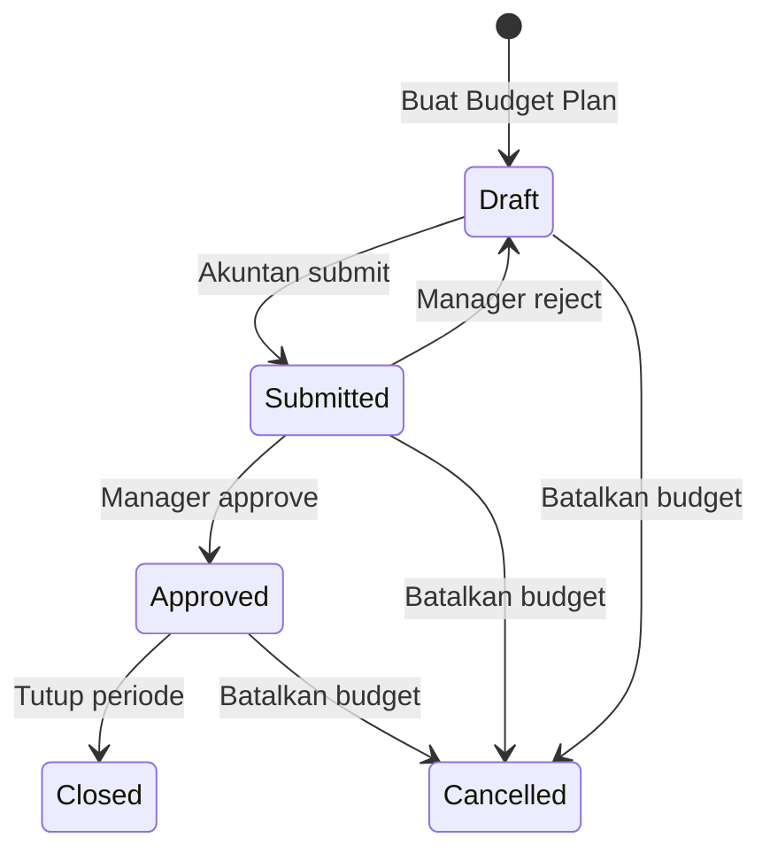
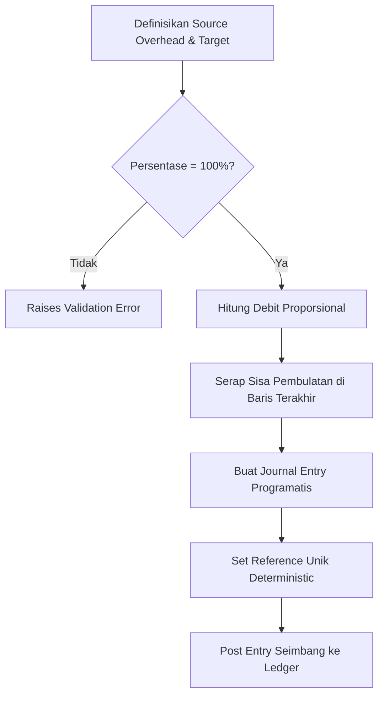
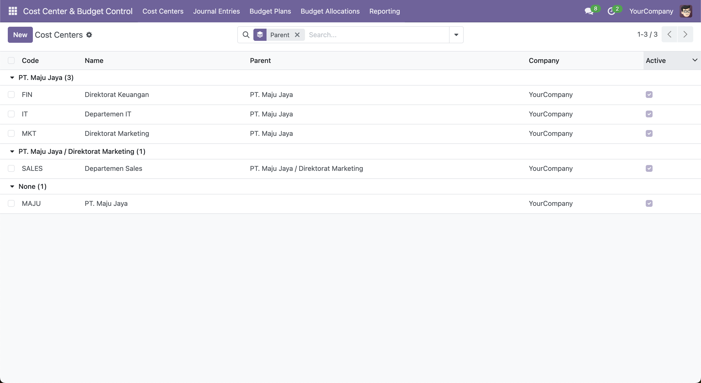
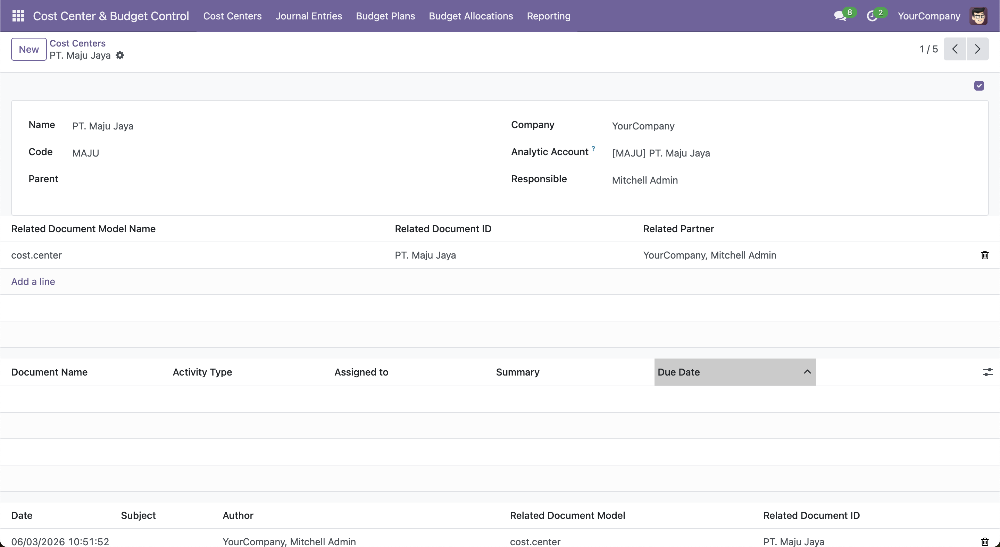
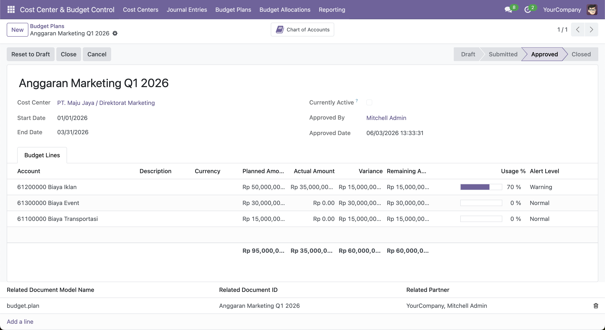
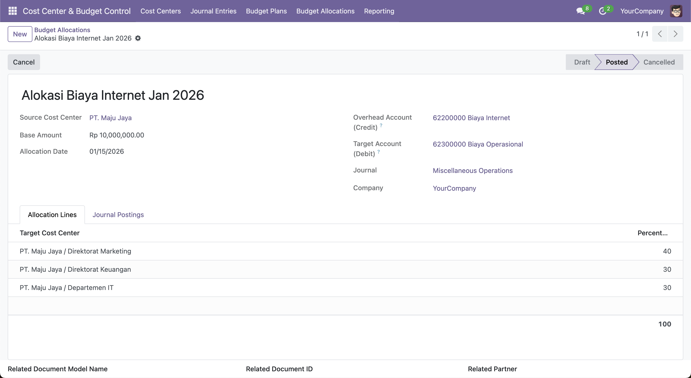
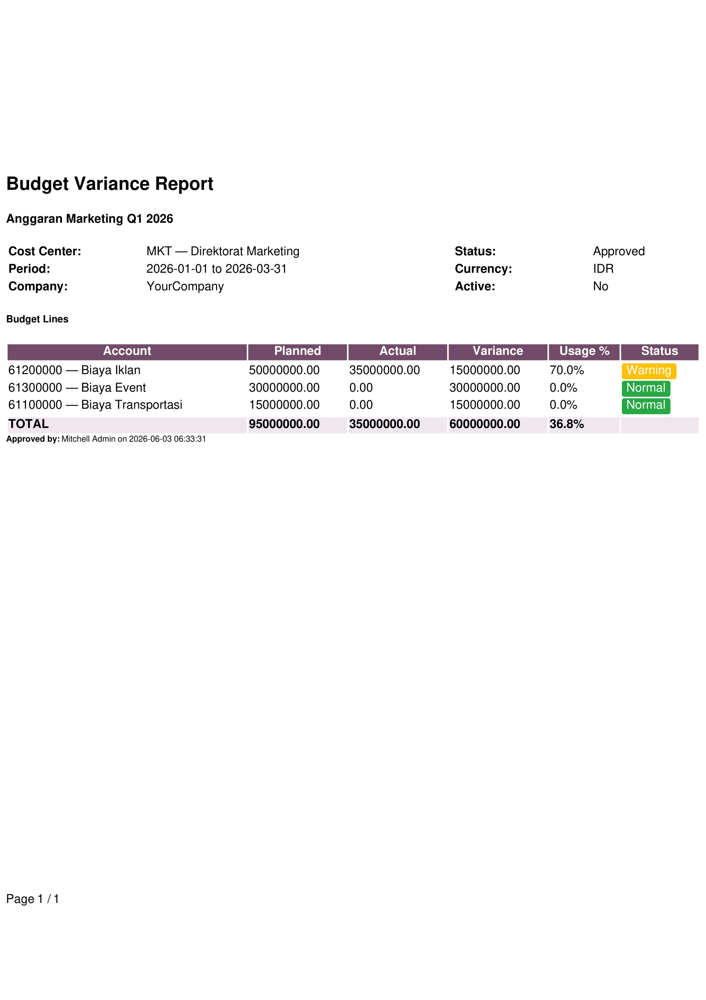

# Cost Center & Budget Control

[](https://github.com/jaizyikhwan/odoo18-cost-center/actions/workflows/test.yml)
[](https://www.odoo.com/documentation/18.0/)
[](https://www.gnu.org/licenses/lgpl-3.0)
[](https://odoo-community.org/)

Module Odoo 18 Community Edition untuk mengelola hierarki cost center, mengontrol penggunaan budget, dan mendistribusikan biaya antar departemen secara otomatis.

---

## Ringkasan Proyek Singkat
Module ini membawa perencanaan budget per departemen dan alokasi biaya ke dalam Odoo 18. Pantau penggunaan budget secara real-time lewat analytic accounting Odoo, hasilkan journal entry otomatis untuk distribusi biaya, dan cegah pengeluaran melampaui budget lewat validasi threshold yang bisa dikonfigurasi.

Cocok untuk organisasi yang membutuhkan disiplin keuangan ketat, module ini melengkapi kemampuan akunting bawaan Odoo dengan kontrol ledger yang kuat, pengaman multi-perusahaan, dan workflow lifecycle yang terkontrol.

---

## Konteks Bisnis
Secara default, fitur analytic accounting Odoo memang andal untuk melacak biaya, tapi belum punya mekanisme bawaan yang menahan pengeluaran sebelum melampaui batas budget per departemen. Akibatnya, manajer baru sadar ada kelebihan budget lewat laporan retrospektif di akhir bulan — saat transaksi sudah terlanjur diposting.

Module ini menutup celah tersebut dengan memvalidasi transaksi secara real-time di alur posting. Setiap pengeluaran dicek terhadap budget departemen yang sudah disetujui sebelum entri final. Selain itu, module mempermudah distribusi biaya bersama antar departemen lewat transaksi ledger yang seimbang, jelas, dan bisa ditelusuri.

---

## Cakupan Teknis
- **Platform**: Odoo 18.0 Community Edition
- **Database**: PostgreSQL (mendukung query JSONB dan pengindexan khusus)
- **Bahasa**: Python 3
- **Mekanisme Odoo**: Extend native Accounting, menggunakan Analytic Account Lines (`account.analytic.line`) dan framework Analytic Distribution, dengan logika isolasi multi-perusahaan.

---

## Fitur Utama
- **Hierarki Cost Center**: Susunan parent-child untuk struktur organisasi, terhubung ke analytic account per perusahaan.
- **Budget Plan dengan Workflow**: Siklus budget yang dilindungi state (Draft → Submitted → Approved → Closed/Cancelled), transisi jelas, dan plan yang sudah final dikunci agar tidak bisa diubah.
- **Agregasi Analytic Real-time**: Perhitungan actual expenditure langsung dari analytic distribution dan analytic account.
- **Alokasi Biaya Otomatis**: Penyesuaian ledger seimbang yang memindahkan biaya dari overhead pool ke cost center target berdasarkan persentase.
- **Validasi Threshold Budget**: Kontrol warning, critical, dan blocking yang aktif otomatis saat posting journal entry.
- **Override Berbasis Peran**: Permission terstruktur agar manajer berwenang bisa memposting transaksi yang melampaui batas blocking dengan justifikasi bisnis.

---

## Pilar Arsitektur

### 1. Integritas Data & Imutabilitas
Budget plan yang sudah final (approved, closed, cancelled) dikunci total di level ORM. Tujuannya: lindungi histori, cegah modifikasi tidak sengaja. Upaya mengubah atau menghapus record yang sudah final akan ditolak.

### 2. Disiplin Workflow & Tata Kelola
Siklus budget diatur oleh state machine yang menentukan siapa boleh melakukan transisi apa. Contoh: transisi dari draft ke approved butuh otorisasi manajer. Ini menciptakan kontrol internal yang kuat dan audit trail jelas sebelum budget aktif.

### 3. Akurasi & Ketertelusuran Ledger
Mesin alokasi biaya menjamin akurasi pembukuan. Semua entry ledger yang dihasilkan program selalu seimbang; sisa pembulatan otomatis diserap di baris target terakhir, sehingga total debit sama persis dengan kredit. Referensi alokasi yang idempotent dihasilkan untuk mencegah duplikasi.

### 4. Keamanan Multi-Perusahaan yang Ketat
Operasi multi-perusahaan butuh isolasi ketat. Module ini enforcing pemisahan batasan di level ORM lewat validasi sadar perusahaan. Referensi akuntansi lintas perusahaan ditolak; budget plan, cost center, dan journal terisolasi sesuai perusahaan aktif.

### 5. Validasi Budget Proaktif
Alih-alih lapor di belakang, module melakukan validasi terintegrasi dalam workflow posting. Saat transaksi standard diposting, sistem evaluasi proyeksi pengeluaran terhadap sisa budget. Kalau menyebabkan overrun di mode blocking, sistem hentikan operasi dan minta otorisasi Override Manager.

---

## Gambaran Workflow dari Sisi Pengguna

### 1. Siklus Budget
1. **Perencanaan (Planning)**: Akuntan membuat budget plan baru di state `Draft` untuk cost center dan periode tertentu, menambahkan detail pos biaya yang diproyeksikan.
2. **Review**: Akuntan submit budget untuk approval, status berpindah ke `Submitted`, edit dibatasi hanya untuk Budget Manager.
3. **Aktivasi**: Budget Manager mereview alokasi lalu klik **Approve** — definisi budget plan dikunci, status berpindah ke `Approved`.
4. **Operasional**: Begitu ada posting Odoo yang sesuai dengan analytic account cost center dan akun biaya, sistem mengagregasi actual expenditure secara real-time.
5. **Penutupan (Closure)**: Begitu periode selesai, budget plan ditandai `Closed` atau `Cancelled` untuk retensi histori.



### 2. Workflow Alokasi Biaya
1. **Aturan (Rule Setup)**: Manajer mendefinisikan source cost center (overhead pool), target cost center, dan persentase alokasi.
2. **Verifikasi**: Sistem verifikasi total persentase target = 100%.
3. **Eksekusi**: Manajer trigger proses alokasi. Sistem hitung nilai proporsional, serap sisa pembulatan di baris target akhir.
4. **Posting ke Ledger**: Sistem hasilkan dan posting journal entry (`account.move`) yang seimbang — debit ke target cost center, kredit ke source cost center, dengan analytic distribution.
5. **Pengaman Idempotency**: Transaksi ditandai reference key unik yang deterministic. Kalau proses dijalankan ulang untuk periode dan pool yang sama, sistem kenali entry existing dan cegah duplikasi.



### 3. Alur Validasi Threshold Budget
1. **Tangkap Transaksi**: Akuntan memposting vendor bill atau journal entry yang mengandung analytic account terhubung ke cost center termonitor.
2. **Cek Budget Live**: Odoo intercept workflow posting untuk hitung total proyeksi actual terhadap baris budget plan terkait.
3. **Penilaian Threshold**:
   - **Di bawah 70%**: Posting berjalan normal.
   - **70% – 90% (Warning)**: Posting selesai, tapi pesan warning di-log ke chatter dokumen.
   - **90% – 100% (Critical)**: Posting selesai, warning di-log ke chatter, dan Odoo otomatis jadwalkan activity alert untuk Budget Manager.
   - **Di atas 100% (Exceeded)**: Kalau mode blocking aktif, transaksi gagal dan muncul error dialog — kecuali konteks termasuk security token Override Manager.

---

## Instalasi & Panduan Cepat

### Prasyarat
- Docker dan Docker Compose terinstall.
- Git client.

### Quick Start
Untuk spin up database PostgreSQL dan instance Odoo dengan module cost center & budget control yang sudah ter-mount:

```bash
# Clone repository
git clone https://github.com/jaizyikhwan/odoo18-cost-center.git
cd odoo18-cost-center

# Jalankan ekosistem dalam container
docker compose up -d

# Cek log startup
docker compose logs -f odoo
```

Setelah Odoo selesai inisialisasi, buka `http://localhost:8018` di browser. Install app **Cost Center & Budget Control** (`cost_center_budget_control`) dari dashboard Odoo Apps.

*Catatan: Volume `addons/` yang ter-mount memungkinkan perubahan file lokal langsung ter-reflect di Odoo saat upgrade.*

---

## Gambaran Struktur Repository

```
odoo-cost-center/
├── addons/
│   └── cost_center_budget_control/
│       ├── __init__.py
│       ├── __manifest__.py
│       ├── controllers/                   # Web controllers (placeholder untuk extension)
│       ├── models/                        # Logika model Python
│       │   ├── cost_center.py             # Hierarki cost center
│       │   ├── budget_plan.py             # Budget plan & kalkulasi actual
│       │   ├── allocation.py              # Alokasi biaya overhead programatis
│       │   ├── account_move.py            # Intercept posting transaksi & cek threshold
│       │   ├── account_analytic.py        # Extended Odoo analytic account
│       │   └── res_config_settings.py     # Parameter sistem budget control
│       ├── security/                      # Grup security XML & record rules
│       │   ├── security.xml               # Grup security
│       │   ├── ir_rule.xml                # Record rules multi-perusahaan
│       │   └── ir.model.access.csv        # Access control lists (ACL)
│       ├── views/                         # Definisi UI & view XML
│       ├── demo/                          # Data demo XML untuk testing
│       └── tests/                         # Test suite Odoo
├── config/                                # File konfigurasi Odoo
├── docker-compose.yml                     # Definisi multi-container
└── .env                                   # Parameter environment
```

- **`models/`**: Berisi semua workflow akunting dan constraint bisnis dalam pure Python.
- **`security/`**: Definisikan aturan isolasi multi-perusahaan dan segregasi peran.
- **`views/`**: Implementasi status bar, pewarnaan kondisional berdasarkan alert level, dan action reporting.
- **`tests/`**: Test suite komprehensif yang memverifikasi override threshold, kegagalan validasi, dan agregasi distribusi.

---

## Tangkapan Layar

### 1. Cost Centers — Daftar Hierarkis
*Daftar cost center dikelompokkan berdasarkan parent_id, menampilkan struktur parent → child secara sekilas.*


### 2. Form Cost Center
*Detail form satu cost center dengan link analytic account, user penanggung jawab, dan isolasi perusahaan.*


### 3. Form Budget Plan
*State Approved dengan baris item tersemat, progress bar penggunaan, dan baris over-budget yang ditandai warna bahaya (decoration-danger).*


### 4. Form Allocation
*Source cost center overhead, persentase target, badge state Posted, dan idempotency reference key.*


### 5. Laporan Variance Budget
*Report PDF QWeb yang membandingkan planned vs actual variance per cost center (A4, paperformat_euro).*


---

## Perbandingan: Tanpa vs Dengan Module Ini

| Aspek | Tanpa Module | Dengan Module |
|---|---|---|
| **Deteksi budget overrun** | Baru ketahuan di laporan retrospektif (akhir bulan) | Real-time, saat `_post` di setiap `account.move` |
| **Override governance** | Siapapun yang punya akses Accounting bisa posting | Berbasis group: butuh `group_budget_override_manager` |
| **Alokasi biaya** | Journal entry manual, sering ada rounding error | Otomatis program, seimbang sempurna, reference idempotent |
| **Keamanan multi-perusahaan** | Filter manual oleh akuntan | Diterapkan di level ORM (`_check_company_auto` + record rules) |
| **Disiplin state** | Budget plan bebas diedit | Dikunci di state `approved` / `closed` / `cancelled` |
| **Threshold budget** | Fixed di 70/90/100 | Bisa dikonfigurasi lewat UI Settings |
| **Notifikasi** | Review manual | Warning di chatter, penjadwalan activity, mail template |
| **Reporting** | Pivot generic | Menu Reporting khusus dengan agregasi SQL teroptimasi |

---

## Catatan Teknis & Integritas Arsitektur

### Agregasi & Pengindexan yang Teroptimasi
Untuk mencegah degradasi database saat mengagregasi histori transaksi besar:
- Agregasi (`models/budget_plan.py`) manfaatkan query database terparameter yang scan field JSONB `analytic_distribution` secara langsung.
- Index database komposit pada `(company_id, parent_state, date)` dan GIN index kustom pada `analytic_distribution` dipasang saat instalasi module untuk memastikan scan efisien.
- Hindari Python loop besar dengan lakukan operasi matematika langsung di engine database sebelum load dataset ke memori Odoo.

### Pengaman Multi-Perusahaan yang Robust
Isolasi dijamin lewat konfigurasi deklaratif:
- Semua model line menggunakan `_check_company_auto=True` dan many2one pakai `check_company=True` untuk menolak record lintas perusahaan.
- XML rule mengisolasi baris secara dinamis berdasarkan konteks user aktif. Posting akuntansi lintas perusahaan benar-benar diblokir.

### Kalkulasi Ledger yang Konsisten
Alur alokasi menjalankan panduan keamanan finansial:
- Sisa pembulatan ditangani dengan menghitung nilai proporsional target dan memindahkan floating point ke baris journal terakhir. Ini menjamin debit dan kredit seimbang persis sampai desimal currency terkecil.
- Duplikasi dicegah di level index database unik lewat reference hash multi-bagian yang deterministic.

---

## Pengembangan Mendatang
- **Scheduled Allocations**: Integrasi dengan cron Odoo untuk eksekusi alokasi bulanan otomatis.
- **Export Tool yang Ditingkatkan**: Template reporting xlsx yang memformat kalkulasi variance biaya untuk stakeholder.
- **Expense Forecast Tools**: Model forecasting proporsional berdasarkan tren historis.
- **Multi-Level Approval Path**: Approval berbasis sequence yang sesuai hierarki operasional custom.

---

## Lisensi & Kredit
- **Lisensi**: LGPL-3.0
- **Pengembang**: Muhammad Ikhwan Jaizy (https://github.com/jaizyikhwan)
