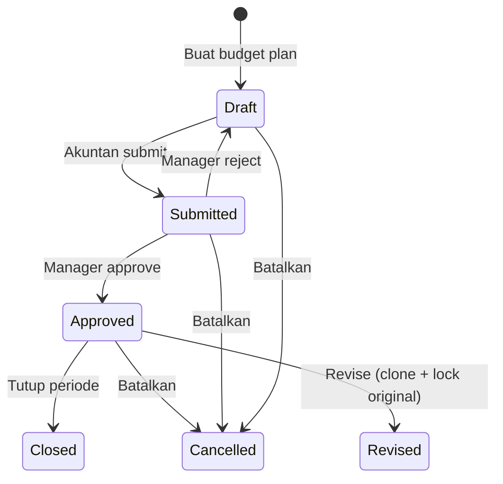

# Cost Center & Budget Control

[](https://github.com/jaizyikhwan/odoo18-cost-center/actions/workflows/test.yml)
[](https://www.odoo.com/documentation/18.0/)
[](https://www.gnu.org/licenses/lgpl-3.0)
[](https://odoo-community.org/)
[](CHANGELOG.md)

Modul Odoo 18 Community Edition untuk governance cost center, enforcement budget real-time, PO committed tracking, dan version control budget dengan chain revisi yang immutable.

---

## Daftar Isi

- [Tentang Modul](#tentang-modul)
- [Quick Start](#quick-start)
- [Demo & Dokumentasi](#demo--dokumentasi)
- [Fitur](#fitur)
- [Workflow dari Sisi Pengguna](#workflow-dari-sisi-pengguna)
- [Instalasi](#instalasi)
- [Struktur Repository](#struktur-repository)
- [Screenshots](#screenshots)
- [Native Odoo 18 vs Modul Ini](#native-odoo-18-vs-modul-ini)
- [vs OCA `account_budget_oca`](#vs-oca-account_budget_oca)
- [Catatan Teknis](#catatan-teknis)
- [Performa](#performa)
- [Roadmap](#roadmap)
- [Lisensi & Kredit](#lisensi--kredit)

---

## Tentang Modul

Odoo 18 CE sudah punya `account.budget` (analytic budget) yang cukup untuk *visibility*: pivot, grafik, threshold reporting. Tapi tidak ada *enforcement* — transaksi yang melebihi budget tetap bisa di-posting, dampaknya baru terlihat di laporan setelahnya.

Modul ini menambahkan enforcement layer di atas native Odoo:

1. **Hard-block di posting** — transaksi yang akan melampaui threshold ditolak saat `_post()`, bukan cuma ditandai.
2. **Role-based override** — manager bisa bypass lewat group membership (bukan context flag, jadi tidak bisa diprivilege-escalate).
3. **PO Committed tracking** — confirmed-but-unbilled PO line diagregasi ke budget line, jadi Anda tahu `actual + committed` secara real-time. Native Odoo CE tidak punya ini (Enterprise-only).
4. **Hierarchical cost center tree** — `account.analytic.plan` di Odoo flat, modul ini punya `cost.center` dengan `parent_path` untuk struktur parent-child.
5. **Programmatic overhead allocation** — distribusi biaya antar cost center via balanced journal entry, dengan SHA1 idempotency (coba jalankan dua kali untuk periode yang sama, hanya satu entry yang terbuat).
6. **Budget revision chain** — `Revise` native Odoo cuma rename + suffix `(Rev)`. Modul ini clone budget, lock original sebagai immutable history, dan link via `parent_revision_id`.

Cocok untuk organisasi yang butuh *budget discipline*, bukan hanya *visibility*: manufacturing (PO-heavy), holding company, NGO dengan donor grant compliance, BUMN/BUMD dengan PAGU strict.

---

## Quick Start

```bash
git clone https://github.com/jaizyikhwan/odoo18-cost-center.git
cd odoo-cost-center
docker compose up -d
```

Setelah Odoo ready di `http://localhost:8018`, install **Cost Center & Budget Control** dari Apps menu. Detail lengkap di [`readme/USAGE.md`](readme/USAGE.md).

---

## Demo & Dokumentasi

| Resource | Tautan |
|---|---|
| Architecture deep-dive | [`docs/ARCHITECTURE.md`](docs/ARCHITECTURE.md) — Mermaid diagrams, state machine, extension points |
| Integration guide (vs OCA, vs Enterprise) | [`docs/INTEGRATION.md`](docs/INTEGRATION.md) |
| Performance benchmarks | [`docs/PERFORMANCE.md`](docs/PERFORMANCE.md) |
| User guide | [`readme/USAGE.md`](readme/USAGE.md) |
| Roadmap | [`readme/ROADMAP.md`](readme/ROADMAP.md) |
| Changelog | [`CHANGELOG.md`](CHANGELOG.md) |

---

## Fitur

### Governance & Enforcement

- Hierarki cost center dengan parent-child structure, terisolasi per perusahaan.
- Budget plan dengan workflow state machine: `Draft → Submitted → Approved → Revised → Closed/Cancelled`. Plan yang sudah final di-lock di level ORM, tidak bisa di-edit atau dihapus.
- Threshold validation 3-level (warning, critical, blocking) yang aktif saat posting journal entry. Mode blocking raise `UserError` sebelum transaksi final.
- Override berbasis group membership (3-tier: User / Manager / Override Manager), dengan audit trail di chatter.
- Budget revision workflow dengan `parent_revision_id` chain — original immutable, revision baru fully editable.

### Tracking & Aggregation

- Real-time `actual_amount` aggregation via SQL JSONB query pada `analytic_distribution` (GIN-indexed untuk performance).
- PO Committed tracking: `po_committed_amount` + `committed_amount` (actual + po_committed) + `available_amount` (planned − committed).
- Auto-recompute pada PO confirm, cancel, amend, dan line write/unlink.

### Accounting Engine

- Overhead allocation engine yang generate balanced journal entry. Rounding residual diserap di baris terakhir, jadi debit == kredit exact.
- SHA1 idempotency reference — duplicate detection di level database, bukan di Python.
- Reversal: allocation yang sudah posted bisa di-reverse via `_reverse_moves()` dengan audit reference.

### Reporting

- QWeb PDF variance report per cost center × account, dengan status indicator (Normal/Warning/Critical/Exceeded).
- Pivot dan graph views dengan filter over-budget, warning, danger, exceeded, over-committed.
- Revision chain indicator di PDF report.

---

## Workflow dari Sisi Pengguna

### 1. Siklus Budget

1. Akuntan buat budget plan di state `Draft` untuk cost center dan periode tertentu.
2. Submit untuk approval → state `Submitted`. Edit terbatas hanya untuk Budget Manager.
3. Manager approve → state `Approved`. Definisi budget plan terkunci.
4. Transaksi Odoo yang sesuai analytic + akun biaya diagregasi real-time.
5. Periode selesai → `Closed` atau `Cancelled`.



### 2. Workflow Alokasi Biaya

1. Manager definisikan source cost center (overhead pool), target cost centers, dan persentase.
2. Sistem verifikasi total persentase = 100%.
3. Trigger alokasi. Sistem hitung proporsional, serap sisa pembulatan di baris terakhir.
4. Posting ke ledger sebagai balanced journal entry (debit ke target, kredit ke source, dengan analytic distribution).
5. Reference key deterministic mencegah duplikasi: jalankan ulang untuk periode yang sama, sistem kenali entry existing.

### 3. Alur Threshold Validation

1. Transaksi di-post (vendor bill, journal entry) dengan analytic account yang terhubung ke cost center termonitor.
2. Sistem hitung proyeksi total actual vs planned.
3. Penilaian:
   - < 70%: posting normal
   - 70–90% (Warning): posting selesai, warning di-log ke chatter
   - 90–100% (Critical): warning di-log + activity alert dijadwalkan ke Budget Manager
   - > 100% (Exceeded): kalau mode blocking aktif, posting gagal dengan error dialog. Override Manager bisa bypass dengan audit trail.

---

## Instalasi

### Prasyarat

- Docker + Docker Compose
- Git

### Langkah

```bash
git clone https://github.com/jaizyikhwan/odoo18-cost-center.git
cd odoo-cost-center
docker compose up -d
docker compose logs -f odoo
```

Buka `http://localhost:8018`, lalu install **Cost Center & Budget Control** (`cost_center_budget_control`) dari Apps menu.

Volume `addons/` ter-mount, jadi perubahan lokal langsung ter-reflect di Odoo saat upgrade.

### Dependencies

`base`, `account`, `analytic`, `mail`, `purchase` — semua bawaan Odoo 18 CE, tidak butuh Enterprise.

---

## Struktur Repository

```
odoo-cost-center/
├── addons/
│   └── cost_center_budget_control/
│       ├── __manifest__.py
│       ├── models/                # logika model Python
│       │   ├── cost_center.py     # hierarki cost center
│       │   ├── budget_plan.py     # budget plan & actual calculation
│       │   ├── allocation.py      # overhead allocation engine
│       │   ├── account_move.py    # intercept posting & threshold check
│       │   ├── account_analytic.py
│       │   ├── purchase_order.py  # PO committed tracking
│       │   ├── allocation_line.py
│       │   └── res_config_settings.py
│       ├── security/              # groups, ACL, multi-company rules
│       ├── views/                 # UI definitions
│       ├── wizard/                # approval wizard, variance export
│       ├── report/                # QWeb PDF variance report
│       ├── data/                  # mail template, ir.cron
│       ├── demo/                  # sample data
│       ├── i18n/                  # translations
│       └── tests/                 # 48 tests
├── config/                        # Odoo config files
├── docs/                          # ARCHITECTURE, INTEGRATION, PERFORMANCE
├── readme/                        # USAGE, ROADMAP, DESCRIPTION
├── docker-compose.yml
└── .env
```

---

## Screenshots

### Cost Centers (hierarkis)

Daftar cost center dikelompokkan berdasarkan parent, menampilkan struktur parent → child sekilas.


### Form Cost Center

Detail cost center dengan link ke analytic account, responsible user, isolasi perusahaan.


### Form Budget Plan

State Approved dengan baris item tersemat, progress bar penggunaan, baris over-budget ditandai warna bahaya.


### Form Allocation

Source cost center overhead, persentase target, badge state Posted, dan idempotency reference key.


### Variance Report (PDF)

Report QWeb yang membandingkan planned vs actual per cost center (A4 paperformat).


---

## Native Odoo 18 vs Modul Ini

| Aspek | Odoo 18 Native | Modul Ini |
|---|---|---|
| Deteksi budget overrun | Dilaporkan di pivot setelah transaksi posted | Hard block di `_post()`, sebelum transaksi final |
| Override governance | Tidak ada | Group-based (`group_budget_override_manager`) dengan audit trail |
| Committed tracking | `Committed` column read-only di report | Field `committed_amount` + `po_committed_amount` + `available_amount`, opt-in PO blocking |
| Alokasi biaya overhead | Manual journal entry, rounding error umum | Programmatic, balanced exact, SHA1 idempotency |
| Cost center tree | `account.analytic.plan` (flat) | `cost.center` dengan `parent_path` (true hierarchy) |
| State discipline | `Draft / Confirmed / Validated / Revised` | `Draft / Submitted / Approved / Revised / Closed / Cancelled` dengan ORM lock |
| Multi-company | Record rules native | `_check_company_auto=True` + record rules |
| Budget revision | Rename + ` (Rev)` suffix | Clone baru editable + original immutable via `parent_revision_id` |
| Threshold configurability | Fixed / via param | Settings UI dengan 3 level threshold |
| Notifications | Mail template native | Mail + chatter post + activity schedule + over-budget alert |
| Reporting | Pivot/Graph native | Pivot/Graph + QWeb PDF dengan revision indicator |

---

## vs OCA `account_budget_oca`

Sebelum bikin modul ini saya lihat OCA ecosystem dulu. `account_budget_oca` (maintained Odoo S.A. + OCA) adalah fondasi yang solid dan saya tidak berniat replace. Modul ini *enforcement layer* di atasnya, bukan pengganti.

| Fitur | OCA `account_budget_oca` | Modul Ini |
|---|---|---|
| Budget per analytic account (planned/actual) | ya (sangat baik) | ya |
| Pivot/graph reporting + 3 built-in reports | ya | ya |
| State machine | ya (basic) | ya (lebih strict, ORM-protected) |
| Hard-block posting saat breach | tidak ada | ya, sebelum `_post()` |
| PO Committed tracking (CE) | tidak ada (Enterprise-only di Odoo) | ya |
| Programmatic overhead allocation | tidak ada | ya (balanced JE + SHA1) |
| Budget revision chain (immutable) | tidak ada | ya (`parent_revision_id`) |
| Hierarchical cost center tree | tidak ada (analytic plan flat) | ya |
| Role-based override governance | tidak ada | ya (3-tier groups) |
| ORM-level state protection | tidak ada | ya |
| Multi-currency per plan | planned, belum shipped | ya |
| CSV/XLSX export variance report | tidak ada | ya |
| Scheduled allocation cron | tidak ada | ya |
| Smart button di cost center | tidak ada | ya |

### Yang tidak di-replace

- `account.budget` (native) untuk basic budget reporting
- `account_budget_oca` (OCA) untuk multi-company crossovered budget
- `account.budget.recurring` (native) untuk scheduled budget creation
- `mis_builder` (OCA) untuk advanced KPI / management reporting

### Kapan modul ini masuk akal

- Manufacturing (menengah-besar) — budget per cost center produksi, 80% spending via PO
- Government / BUMN / BUMD — PAGU harus strict (regulatory)
- Holding company — alokasi overhead bulanan HQ → anak perusahaan
- NGO dengan donor grant — USAID/EU grant compliance, tidak boleh over-spend per kategori
- Universitas multi-fakultas — budget per fakultas/departemen dengan multi-tier approval

### Kapan tidak perlu

- Small business (< 50 karyawan) dengan budget informal
- Perusahaan yang sudah di Odoo Enterprise (sudah ada `account.budget` enforcement)
- Organisasi tanpa proses budget formal

---

## Catatan Teknis

### Agregasi & indexing

Untuk dataset besar, agregasi actual amount scan field JSONB `analytic_distribution` langsung via parameterized SQL, bukan Python loop. Index komposit `(company_id, parent_state, date)` + GIN index custom di `analytic_distribution` dipasang saat module install lewat `post_init_hook`.

### Multi-company isolation

Semua model line pakai `_check_company_auto=True` dan many2one pakai `check_company=True` untuk reject cross-company reference. XML record rules mengisolasi baris berdasarkan company context user. Posting akuntansi lintas perusahaan benar-benar diblokir.

### Konsistensi ledger

Sisa pembulatan di allocation engine ditangani dengan menyerap floating-point residual di baris journal entry terakhir. Hasilnya: debit == kredit sampai desimal currency terkecil, setiap kali. Duplikasi dicegah di level database unique index lewat SHA1 reference key yang deterministic.

---

## Performa

Hasil benchmark (run via `tests/test_performance.py`, captured 2026-06-04, Apple M1 / 8 core / 8 GB RAM / PG 16.13):

| Operasi | Records | Waktu | Per-unit |
|---|---|---|---|
| Compute `actual_amount` (SQL JSONB) | 100 lines | 0.15 s | 1.5 ms/line |
| Compute `po_committed_amount` | 100 lines | 0.16 s | 1.6 ms/line |
| Budget workflow (50 plans × submit + approve) | 50 plans | 0.97 s | 18 ms/plan |
| Move posting dengan budget validation | 50 moves | 3.32 s | 66 ms/move |
| Allocation (25 runs × 50 target CCs) | 25 runs | 6.15 s | 246 ms/run |

Untuk dataset kecil (< 100 budget plans) semua compute di bawah 1 detik. Untuk dataset besar (> 1,000 budget plans) GIN index di `account_move_line.analytic_distribution` jadi critical — index ini dipasang otomatis saat module install.

Detail lengkap di [`docs/PERFORMANCE.md`](docs/PERFORMANCE.md).

---

## Roadmap

- Scheduled allocation cron (UI untuk enable recurring template, sudah ada field-nya, perlu di-expose)
- XLSX export template yang lebih kaya formatting untuk stakeholder
- Forecasting tool dari tren historis
- Multi-level approval path yang sequence-based

Lihat [`readme/ROADMAP.md`](readme/ROADMAP.md) untuk detail.

---

## Lisensi & Kredit

Lisensi: LGPL-3.0

Pengembang: Muhammad Ikhwan Jaizy (https://github.com/jaizyikhwan)
