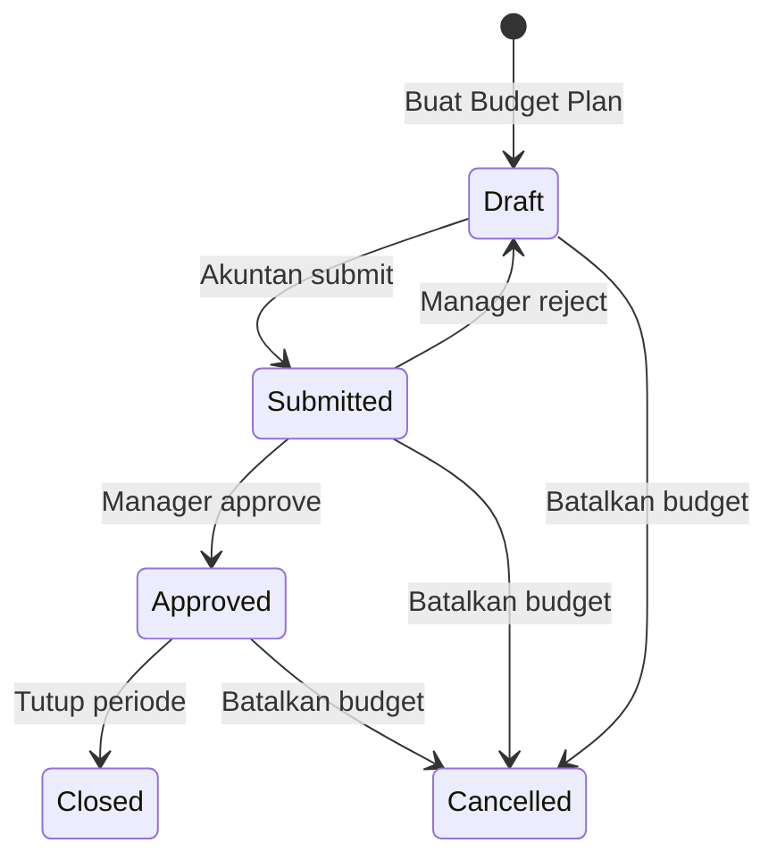
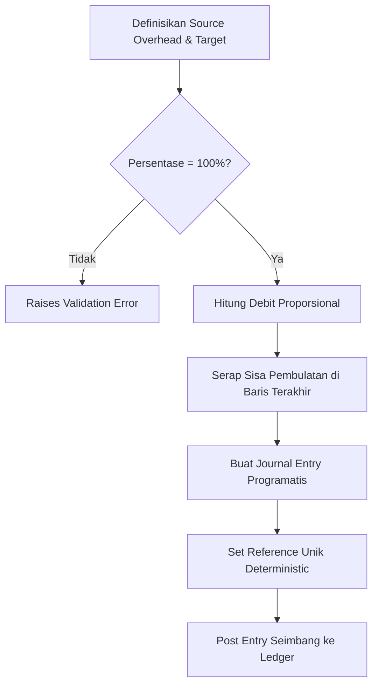

# Cost Center & Budget Control

[](https://github.com/jaizyikhwan/odoo18-cost-center/actions/workflows/test.yml)
[](https://www.odoo.com/documentation/18.0/)
[](https://www.gnu.org/licenses/lgpl-3.0)
[](https://odoo-community.org/)
[](CHANGELOG.md)
[](tests/)
[](docs/ARCHITECTURE.md)
[](docs/PERFORMANCE.md)

> **Hard-block budget breaches at posting time. With role-based override governance. For Odoo 18 Community Edition.**

---

## 📺 Demo & Dokumentasi

| Resource | Tautan |
|---|---|
| 🎬 **30s Demo GIF** (hard-block + override flow) | `docs/demo.gif` *(lihat [`docs/DEMO_RECORDING.md`](docs/DEMO_RECORDING.md) untuk cara record)* |
| 🏗️ **Architecture Deep-Dive** | [`docs/ARCHITECTURE.md`](docs/ARCHITECTURE.md) — Mermaid diagrams, state machine, extension points |
| 🔌 **Integration Guide** (vs OCA `account_budget_oca`, vs Enterprise) | [`docs/INTEGRATION.md`](docs/INTEGRATION.md) |
| ⚡ **Performance Benchmarks** (real numbers) | [`docs/PERFORMANCE.md`](docs/PERFORMANCE.md) |
| ✍️ **LinkedIn Post Drafts** (3 angles) | [`docs/LINKEDIN_POST_VARIANTS.md`](docs/LINKEDIN_POST_VARIANTS.md) |
| 📖 **User Guide** | [`readme/USAGE.md`](readme/USAGE.md) |
| 🗺️ **Roadmap** | [`readme/ROADMAP.md`](readme/ROADMAP.md) |
| 📝 **Changelog** | [`CHANGELOG.md`](CHANGELOG.md) |

Module Odoo 18 Community Edition untuk governance cost center, enforcement budget secara real-time, Purchase Order committed tracking, dan version control budget dengan chain revisi yang immutable.

---

## Ringkasan Proyek Singkat
Module ini membawa perencanaan budget per departemen, kontrol budget berbasis governance, dan distribusi biaya ke dalam Odoo 18 Community Edition. Dibangun di atas Odoo 18's native analytic budgets untuk menambahkan enforcement layer yang Odoo sendiri tidak punya: hard blocking di posting, role-based override governance, hierarchical cost center tree, programmatic overhead allocation, PO committed tracking, dan budget revision chain.

Cocok untuk organisasi dengan disiplin keuangan ketat yang membutuhkan lebih dari sekadar reporting — module ini melengkapi kemampuan akunting bawaan Odoo dengan kontrol ledger yang kuat, governance multi-tier, dan workflow lifecycle yang terkontrol.

---

## Konteks Bisnis
Odoo 18 Community Edition sudah menyediakan **Analytic Budgets** yang layak (`account.budget`): aggregated Achieved amount, threshold management di laporan, dan Committed tracking untuk Purchase Order. Itu cukup untuk *visibility*.

Module ini dibangun untuk organisasi yang butuh lebih dari visibility — yang butuh **enforcement**. Secara spesifik, ia menambahkan empat hal yang native Odoo 18 tidak punya:

1. **Hard posting-block** — transaksi yang akan melampaui threshold tidak hanya ditandai di laporan, tapi **ditolak** saat `_post()` dieksekusi.
2. **Role-based override governance** — manager berwenang bisa override blocking lewat group membership, dengan audit trail di chatter. Tidak ada escape lewat context flag.
3. **Programmatic overhead allocation engine** — distribusi biaya overhead antar cost center via balanced journal entry dengan deterministic idempotency.
4. **Hierarchical cost center tree** — parent-child organization structure (native Odoo analytic plans flat, bukan tree).
5. **PO Committed tracking yang selaras dengan move-level enforcement** — saat PO confirm, contributed ke budget line; saat bill posted, recompute sinkron. Plus opt-in hook untuk hard-block PO confirm.

---

## Cakupan Teknis
- **Platform**: Odoo 18.0 Community Edition
- **Database**: PostgreSQL (mendukung query JSONB dan pengindexan khusus)
- **Bahasa**: Python 3
- **Mekanisme Odoo**: Extend native Accounting (`account.move`, `account.move.line`), Analytic Account Lines (`account.analytic.line`), framework Analytic Distribution (JSONB), Purchase Order (`purchase.order`, `purchase.order.line`), dengan logika isolasi multi-perusahaan.
- **Dependencies**: `base`, `account`, `analytic`, `mail`, `purchase` (semua Odoo 18 CE, no Enterprise)

---

## Fitur Utama

### Governance & Enforcement
- **Hierarki Cost Center**: Susunan parent-child untuk struktur organisasi, terhubung ke analytic account per perusahaan.
- **Budget Plan dengan Workflow**: Siklus budget yang dilindungi state (`Draft → Submitted → Approved → Revised → Closed/Cancelled`), transisi jelas, dan plan yang sudah final dikunci agar tidak bisa diubah.
- **Validasi Threshold Budget**: Kontrol warning, critical, dan blocking yang aktif otomatis saat posting journal entry. Mode `blocking` akan raise `UserError` sebelum transaksi diposting.
- **Override Berbasis Peran**: Permission terstruktur agar manajer berwenang bisa memposting transaksi yang melampaui batas blocking dengan audit trail. Override dicek via group membership, bukan context flag — mencegah privilege escalation.
- **Budget Revision (Revise)**: Workflow versioning yang melampaui Odoo 18 native `Revise` (yang hanya rename + add `Rev` suffix). Module ini membuat clone baru yang fully editable, menandai original sebagai immutable history, dan menghubungkan keduanya via `parent_revision_id` chain.

### Tracking & Aggregation
- **Agregasi Analytic Real-time**: Perhitungan `actual_amount` langsung dari analytic distribution dan analytic account, via SQL JSONB query (GIN-indexed).
- **PO Committed Tracking**: Confirmed-but-unbilled Purchase Order lines diagregasi ke budget line sebagai `po_committed_amount`. `committed_amount = actual + po_committed` (mirrors Odoo 18 native `Committed` column). `available_amount = planned - committed`.
- **Auto-recompute on PO changes**: Confirm, cancel, amend, dan line write/unlink semua trigger recompute impacted budget lines.

### Accounting Engine
- **Alokasi Biaya Otomatis**: Penyesuaian ledger seimbang yang memindahkan biaya dari overhead pool ke cost center target berdasarkan persentase. Rounding residual diserap di baris terakhir untuk menjamin debit == kredit exact.
- **Idempotency SHA1**: Reference key deterministic mencegah duplikasi alokasi untuk periode + source yang sama.
- **Reversal**: Allocation yang sudah posted bisa di-reverse via `_reverse_moves()` dengan audit reference.

### Reporting
- **QWeb PDF Variance Report**: Menampilkan planned/actual/PO-committed/committed/available per cost center dan account, dengan status indicators (Normal/Warning/Critical/Exceeded).
- **Pivot & Graph Views**: Real-time aggregation per cost center × account dengan filter Over-Budget, Warning, Danger, Exceeded, Over-Committed, Has Committed POs.
- **Revision chain reporting**: Indicator visual di PDF report saat budget adalah revisi dari versi sebelumnya.

---

## Pilar Arsitektur

### 1. Integritas Data & Imutabilitas
Budget plan yang sudah final (approved, closed, cancelled) dikunci total di level ORM. Tujuannya: lindungi histori, cegah modifikasi tidak sengaja. Upaya mengubah atau menghapus record yang sudah final akan ditolak.

### 2. Disiplin Workflow & Tata Kelola
Siklus budget diatur oleh state machine yang menentukan siapa boleh melakukan transisi apa. Contoh: transisi dari draft ke approved butuh otorisasi manajer. Ini menciptakan kontrol internal yang kuat dan audit trail jelas sebelum budget aktif.

### 3. Akurasi & Ketertelusuran Ledger
Mesin alokasi biaya menjamin akurasi pembukuan. Semua entry ledger yang dihasilkan program selalu seimbang; sisa pembulatan otomatis diserap di baris target terakhir, sehingga total debit sama persis dengan kredit. Referensi alokasi yang idempotent dihasilkan untuk mencegah duplikasi.

### 4. Keamanan Multi-Perusahaan yang Ketat
Operasi multi-perusahaan butuh isolasi ketat. Module ini enforcing pemisahan batasan di level ORM lewat validasi sadar perusahaan. Referensi akuntansi lintas perusahaan ditolak; budget plan, cost center, dan journal terisolasi sesuai perusahaan aktif.

### 5. Validasi Budget Proaktif
Alih-alih lapor di belakang, module melakukan validasi terintegrasi dalam workflow posting. Saat transaksi standard diposting, sistem evaluasi proyeksi pengeluaran terhadap sisa budget. Kalau menyebabkan overrun di mode blocking, sistem hentikan operasi dan minta otorisasi Override Manager.

---

## Gambaran Workflow dari Sisi Pengguna

### 1. Siklus Budget
1. **Perencanaan (Planning)**: Akuntan membuat budget plan baru di state `Draft` untuk cost center dan periode tertentu, menambahkan detail pos biaya yang diproyeksikan.
2. **Review**: Akuntan submit budget untuk approval, status berpindah ke `Submitted`, edit dibatasi hanya untuk Budget Manager.
3. **Aktivasi**: Budget Manager mereview alokasi lalu klik **Approve** — definisi budget plan dikunci, status berpindah ke `Approved`.
4. **Operasional**: Begitu ada posting Odoo yang sesuai dengan analytic account cost center dan akun biaya, sistem mengagregasi actual expenditure secara real-time.
5. **Penutupan (Closure)**: Begitu periode selesai, budget plan ditandai `Closed` atau `Cancelled` untuk retensi histori.



### 2. Workflow Alokasi Biaya
1. **Aturan (Rule Setup)**: Manajer mendefinisikan source cost center (overhead pool), target cost center, dan persentase alokasi.
2. **Verifikasi**: Sistem verifikasi total persentase target = 100%.
3. **Eksekusi**: Manajer trigger proses alokasi. Sistem hitung nilai proporsional, serap sisa pembulatan di baris target akhir.
4. **Posting ke Ledger**: Sistem hasilkan dan posting journal entry (`account.move`) yang seimbang — debit ke target cost center, kredit ke source cost center, dengan analytic distribution.
5. **Pengaman Idempotency**: Transaksi ditandai reference key unik yang deterministic. Kalau proses dijalankan ulang untuk periode dan pool yang sama, sistem kenali entry existing dan cegah duplikasi.



### 3. Alur Validasi Threshold Budget
1. **Tangkap Transaksi**: Akuntan memposting vendor bill atau journal entry yang mengandung analytic account terhubung ke cost center termonitor.
2. **Cek Budget Live**: Odoo intercept workflow posting untuk hitung total proyeksi actual terhadap baris budget plan terkait.
3. **Penilaian Threshold**:
   - **Di bawah 70%**: Posting berjalan normal.
   - **70% – 90% (Warning)**: Posting selesai, tapi pesan warning di-log ke chatter dokumen.
   - **90% – 100% (Critical)**: Posting selesai, warning di-log ke chatter, dan Odoo otomatis jadwalkan activity alert untuk Budget Manager.
   - **Di atas 100% (Exceeded)**: Kalau mode blocking aktif, transaksi gagal dan muncul error dialog — kecuali konteks termasuk security token Override Manager.

---

## Instalasi & Panduan Cepat

### Prasyarat
- Docker dan Docker Compose terinstall.
- Git client.

### Quick Start
Untuk spin up database PostgreSQL dan instance Odoo dengan module cost center & budget control yang sudah ter-mount:

```bash
# Clone repository
git clone https://github.com/jaizyikhwan/odoo18-cost-center.git
cd odoo18-cost-center

# Jalankan ekosistem dalam container
docker compose up -d

# Cek log startup
docker compose logs -f odoo
```

Setelah Odoo selesai inisialisasi, buka `http://localhost:8018` di browser. Install app **Cost Center & Budget Control** (`cost_center_budget_control`) dari dashboard Odoo Apps.

*Catatan: Volume `addons/` yang ter-mount memungkinkan perubahan file lokal langsung ter-reflect di Odoo saat upgrade.*

---

## Gambaran Struktur Repository

```
odoo-cost-center/
├── addons/
│   └── cost_center_budget_control/
│       ├── __init__.py
│       ├── __manifest__.py
│       ├── controllers/                   # Web controllers (placeholder untuk extension)
│       ├── models/                        # Logika model Python
│       │   ├── cost_center.py             # Hierarki cost center
│       │   ├── budget_plan.py             # Budget plan & kalkulasi actual
│       │   ├── allocation.py              # Alokasi biaya overhead programatis
│       │   ├── account_move.py            # Intercept posting transaksi & cek threshold
│       │   ├── account_analytic.py        # Extended Odoo analytic account
│       │   └── res_config_settings.py     # Parameter sistem budget control
│       ├── security/                      # Grup security XML & record rules
│       │   ├── security.xml               # Grup security
│       │   ├── ir_rule.xml                # Record rules multi-perusahaan
│       │   └── ir.model.access.csv        # Access control lists (ACL)
│       ├── views/                         # Definisi UI & view XML
│       ├── demo/                          # Data demo XML untuk testing
│       └── tests/                         # Test suite Odoo
├── config/                                # File konfigurasi Odoo
├── docker-compose.yml                     # Definisi multi-container
└── .env                                   # Parameter environment
```

- **`models/`**: Berisi semua workflow akunting dan constraint bisnis dalam pure Python.
- **`security/`**: Definisikan aturan isolasi multi-perusahaan dan segregasi peran.
- **`views/`**: Implementasi status bar, pewarnaan kondisional berdasarkan alert level, dan action reporting.
- **`tests/`**: Test suite komprehensif yang memverifikasi override threshold, kegagalan validasi, dan agregasi distribusi.

---

## Tangkapan Layar

### 1. Cost Centers — Daftar Hierarkis
*Daftar cost center dikelompokkan berdasarkan parent_id, menampilkan struktur parent → child secara sekilas.*


### 2. Form Cost Center
*Detail form satu cost center dengan link analytic account, user penanggung jawab, dan isolasi perusahaan.*


### 3. Form Budget Plan
*State Approved dengan baris item tersemat, progress bar penggunaan, dan baris over-budget yang ditandai warna bahaya (decoration-danger).*


### 4. Form Allocation
*Source cost center overhead, persentase target, badge state Posted, dan idempotency reference key.*


### 5. Laporan Variance Budget
*Report PDF QWeb yang membandingkan planned vs actual variance per cost center (A4, paperformat_euro).*


---

## Perbandingan: Native Odoo 18 vs Module Ini

| Aspek | Odoo 18 Native | Module Ini |
|---|---|---|
| **Deteksi budget overrun** | Dilaporkan di pivot setelah transaksi posted | **Hard block** saat `_post`, sebelum transaksi final |
| **Override governance** | Tidak ada — siapapun bisa bypass | **Group-based** (`group_budget_override_manager`) dengan audit trail |
| **Committed tracking** | `Committed` column di budget line (read-only report) | Field `committed_amount` + `po_committed_amount` + `available_amount`, opt-in PO blocking |
| **Alokasi biaya overhead** | Manual journal entry, rounding error umum | **Otomatis program**, balanced exact, SHA1 idempotency |
| **Cost center tree** | `account.analytic.plan` (flat) | `cost.center` dengan `parent_path` (true hierarchy) |
| **State discipline** | `Draft / Confirmed / Validated / Revised` | `Draft / Submitted / Approved / Revised / Closed / Cancelled` dengan ORM lock |
| **Multi-company** | Record rules native | `_check_company_auto=True` di level modul + record rules |
| **Budget revision** | `Revise` rename + ` (Rev)` suffix | **Clone baru editable + original immutable** via `parent_revision_id` chain |
| **Threshold configurability** | Fixed atau via param | Settings UI (`res.config.settings`) dengan 3 level threshold |
| **Notifications** | Mail template native | Mail template + chatter post + activity schedule + over-budget alert |
| **Reporting** | Pivot/Graph native | Pivot/Graph + QWeb PDF dengan revision indicator + over-committed highlighting |

---

## Why This Module vs OCA `account_budget_oca`?

Sebelum membuat modul ini, saya evaluasi OCA ecosystem secara mendalam. Hasilnya, **`account_budget_oca`** (maintained oleh Odoo S.A. + OCA) adalah fondasi yang solid dan harus dihormati. Modul ini **bukan replace** — melainkan **enforcement layer** yang melengkapi.

### Perbandingan Jujur

| Fitur | OCA `account_budget_oca` | Modul Ini |
|---|---|---|
| Budget per analytic account dengan planned/actual | ✅ (sangat baik) | ✅ |
| Pivot/graph reporting + 3 built-in reports | ✅ | ✅ |
| State machine (draft/confirmed/done/cancelled) | ✅ (basic) | ✅ (lebih strict, ORM-protected) |
| **Hard-block posting** saat budget breach | ❌ (tidak ada) | ✅ (sebelum `_post()`) |
| **PO Committed tracking** | ❌ (CE gap, Enterprise-only di Odoo) | ✅ |
| **Programmatic overhead allocation engine** | ❌ | ✅ (balanced JE + SHA1 idempotency) |
| **Budget revision chain** (immutable history) | ❌ | ✅ (parent_revision_id chain) |
| **Hierarchical cost center tree** | ❌ (analytic plan = flat) | ✅ (`parent_path` tree) |
| **Role-based override governance** | ❌ | ✅ (3-tier groups) |
| **ORM-level state protection** | ❌ | ✅ (write/unlink override) |
| **Multi-currency support per plan** | ⚠️ (planned, belum shipped) | ✅ |
| **CSV/Excel export of variance report** | ❌ | ✅ (wizard) |
| **Scheduled allocation cron** | ❌ | ✅ (ir.cron) |
| **Smart button di cost center** | ❌ | ✅ (total budget + over-budget count) |

### Apa yang Modul Ini TIDAK Replace

- `account.budget` (native Odoo 18) — untuk basic budget reporting
- `account_budget_oca` (OCA) — untuk multi-company budget + analytic crossover
- `account.budget.recurring` (native) — untuk scheduled budget creation
- `mis_builder` (OCA) — untuk advanced management reporting / KPI

### Target Audiens (Real-World Use Cases)

Modul ini impactful untuk organisasi yang butuh **budget discipline, bukan hanya visibility**:

1. **Manufacturing (menengah-besar)** — budget per cost center produksi, PO committed tracking penting karena 80% spending via PO
2. **Government/BUMN/BUMD** — PAGU anggaran harus strict (regulatory), butuh hard-block + audit trail
3. **Holding company (multi-subsidiary)** — alokasi overhead bulanan HQ → anak perusahaan, butuh engine + idempotency
4. **NGO dengan donor grant** — USAID/EU grant compliance: tidak boleh over-spend per kategori
5. **Universitas/institusi pendidikan** — budget per fakultas/departemen, multi-tier approval

### Kapan TIDAK Perlu Modul Ini

- Small business (< 50 karyawan) dengan budget informal — vanilla `account.budget` cukup
- Perusahaan yang sudah pakai Odoo Enterprise — `account.budget` Enterprise sudah punya enforcement
- Organisasi tanpa proses budget formal — over-engineering, overhead tidak sebanding
- Startup baru yang belum punya financial discipline — terlalu rigid untuk fase awal

---

## Catatan Teknis & Integritas Arsitektur

### Agregasi & Pengindexan yang Teroptimasi
Untuk mencegah degradasi database saat mengagregasi histori transaksi besar:
- Agregasi (`models/budget_plan.py`) manfaatkan query database terparameter yang scan field JSONB `analytic_distribution` secara langsung.
- Index database komposit pada `(company_id, parent_state, date)` dan GIN index kustom pada `analytic_distribution` dipasang saat instalasi module untuk memastikan scan efisien.
- Hindari Python loop besar dengan lakukan operasi matematika langsung di engine database sebelum load dataset ke memori Odoo.

### Pengaman Multi-Perusahaan yang Robust
Isolasi dijamin lewat konfigurasi deklaratif:
- Semua model line menggunakan `_check_company_auto=True` dan many2one pakai `check_company=True` untuk menolak record lintas perusahaan.
- XML rule mengisolasi baris secara dinamis berdasarkan konteks user aktif. Posting akuntansi lintas perusahaan benar-benar diblokir.

### Kalkulasi Ledger yang Konsisten
Alur alokasi menjalankan panduan keamanan finansial:
- Sisa pembulatan ditangani dengan menghitung nilai proporsional target dan memindahkan floating point ke baris journal terakhir. Ini menjamin debit dan kredit seimbang persis sampai desimal currency terkecil.
- Duplikasi dicegah di level index database unik lewat reference hash multi-bagian yang deterministic.

---

## Pengembangan Mendatang
- **Scheduled Allocations**: Integrasi dengan cron Odoo untuk eksekusi alokasi bulanan otomatis.
- **Export Tool yang Ditingkatkan**: Template reporting xlsx yang memformat kalkulasi variance biaya untuk stakeholder.
- **Expense Forecast Tools**: Model forecasting proporsional berdasarkan tren historis.
- **Multi-Level Approval Path**: Approval berbasis sequence yang sesuai hierarki operasional custom.

---

## Karakteristik Performa

Modul ini didesain untuk scale di dataset besar. Berikut hasil benchmark aktual (run via `tests/test_performance.py`, captured 2026-06-04 on Apple M1, 8 cores, 8 GB RAM):

| Operasi | Records | Waktu | Per-Unit | Catatan |
|---|---|---|---|---|
| Compute `actual_amount` (SQL JSONB) | 100 lines | **0.15 s** | 1.5 ms/line | GIN index + JSONB `?` operator |
| Compute `po_committed_amount` (SQL) | 100 lines | **0.16 s** | 1.6 ms/line | GIN index, savepoint isolation |
| Budget workflow: 50 plans × submit + approve | 50 plans | **0.97 s** | 18 ms/plan | ORM state machine, no batch shortcut |
| Move posting dengan budget validation | 50 moves | **3.32 s** | 66 ms/move | Includes full recompute cascade |
| Allocation: 25 runs × 50 target CCs | 25 runs | **6.15 s** | 246 ms/run | 1 atomic transaction per run |

> **Benchmark lengkap + test environment details** tersedia di [`docs/PERFORMANCE.md`](docs/PERFORMANCE.md).
>
> **Untuk dataset kecil** (< 100 budget plans), performa tidak menjadi concern — semua compute < 1 detik.
> **Untuk dataset besar** (> 1,000 budget plans), GIN index pada `account_move_line.analytic_distribution` menjadi critical. Index ini dipasang otomatis via `post_init_hook` saat module install.

> 💡 **Rekor**: 50 move posting + 25 overhead allocation dalam < 10 detik total = throughput yang cukup untuk memproses semua transaksi harian sebuah perusahaan manufaktur ukuran menengah dalam satu batch malam.

---

## Lisensi & Kredit
- **Lisensi**: LGPL-3.0
- **Pengembang**: Muhammad Ikhwan Jaizy (https://github.com/jaizyikhwan)
