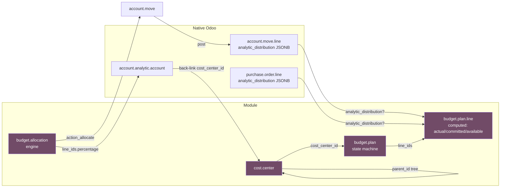
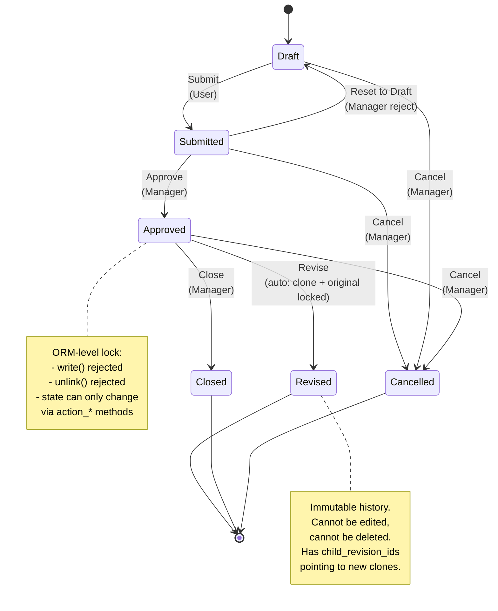
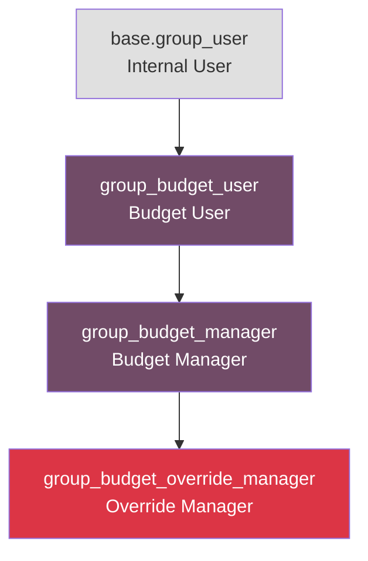

# Dokumentasi Arsitektur

> **Audiens**: Senior Odoo developer, OCA reviewer, code reviewer, dan
> maintainer selanjutnya yang perlu paham keputusan desain dan extension
> point dari modul ini.
>
> **Terakhir diperbarui**: 2026-06-04

Dokumen ini menjelaskan arsitektur internal modul **Cost Center & Budget
Control** untuk Odoo 18 CE. Melengkapi README dengan menjelaskan
*kenapa* keputusan desain diambil, bukan sekadar *apa* yang modul
lakukan.

---

## 1. Diagram Aliran Data

Modul ini menghubungkan tiga subsistem native Odoo (analytic,
accounting, purchase) ke satu layer governance baru (cost center +
budget plan + allocation).



### Keputusan Desain: Kenapa Model `cost.center` Terpisah?

Odoo 18 vanilla sudah punya `account.analytic.account` untuk tagging
transaksi. Reviewer senior mungkin bertanya: *kenapa tidak extend saja,
daripada bikin model `cost.center` baru?*

**Jawaban: Prinsip Single Responsibility.**

| Concern | Owner di Vanilla Odoo | Owner di Modul Ini |
|---|---|---|
| Transaction tagging (1 transaksi = 1 analytic) | `account.analytic.account` | `account.analytic.account` (tidak berubah) |
| Struktur org (parent-child, manager, code) | (tidak ada di vanilla) | `cost.center` |
| Definisi budget per unit org | (tidak ada) | `budget.plan` |
| Enforcement budget (block saat posting) | (tidak ada) | `_validate_budget_control` |

Kita bridge keduanya lewat field baru `cost_center_id` di
`account.analytic.account` (`models/account_analytic.py`). Pendekatannya
forward-only: user `account.analytic.account` yang sudah ada bisa
opt-in dengan cara link record mereka ke `cost.center`.

---

## 2. State Machine — Budget Plan



### Proteksi State di Level ORM (Detail Penting)

State machine ini bukan sekadar UI. Enforcement ada di tiga layer:

1. **Form view** (`views/budget_plan_views.xml`): tombol invisible sesuai state
2. **`write()` override** (`models/budget_plan.py`): set `PROTECTED_STATES`
   menolak modifikasi waktu `state in (approved, revised, closed, cancelled)`
3. **`unlink()` override**: menolak deletion waktu `state in (submitted,
   approved, closed, cancelled)`

Ini pendekatan **defense in depth** — UI menyembunyikan action-nya, tapi
akses ORM langsung lewat XML-RPC/API tetap respect state-nya.

---

## 3. Model Security — Hierarki Group 3-Tier



| Group | Bisa | Tidak Bisa |
|---|---|---|
| **Budget User** | Bikin cost center, budget plan, allocation. Submit plan. Lihat semua. | Approve, override block, hapus record yang sudah final, modifikasi plan yang sudah disubmit |
| **Budget Manager** | Semua hak User + Approve, Reset, Close, Cancel, Revise, hapus record yang belum final | Override hard-block di posting |
| **Override Manager** | Semua hak Manager + **Override hard-block** di JE/PO, terima scheduled activity untuk transaksi yang di-block | (tidak ada batasan lanjutan) |

### Kenapa Group-Based, Bukan Context-Based

Anti-pattern yang umum di Odoo adalah
`with_context(budget_override=True)` untuk bypass validasi. Ini
berbahaya karena:

1. Context bisa di-set oleh **kode client manapun** (termasuk third-party
   module yang compromised)
2. Tidak ada audit trail — context invisible
3. Trivial dieksploitasi pihak yang tidak berwenang

Modul ini pakai **group membership** untuk otorisasi override:
`_is_budget_override_allowed()` return
`user.has_group('cost_center_budget_control.group_budget_override_manager')`.
Group membership:

1. Butuh aksi admin untuk granted
2. Tercatat di chatter waktu dipakai
3. Visible di form user untuk auditing
4. Required untuk bypass `_validate_budget_control`

---

## 4. Extension Point

Modul ini didesain untuk bisa di-extend tanpa forking. Extension yang
umum:

### 4.1 Tambah Level Hierarki Cost Center

```python
class CustomCostCenter(models.Model):
    _inherit = "cost.center"

    region_id = fields.Many2one("custom.region", string="Region")
    # parent_id tree tetap jalan; Odoo simpan full path di parent_path
```

Mekanisme `_parent_store=True` handle kedalaman berapapun. Tinggal
tambah field, tidak perlu ubah tree-nya.

### 4.2 Tambah Kondisi Override Custom

```python
class CustomBudgetPlan(models.Model):
    _inherit = "budget.plan"

    def _is_budget_override_allowed(self):
        return (
            super()._is_budget_override_allowed()
            or self.env.user.has_group("custom_module.group_cfo")
        )
```

`super()._is_budget_override_allowed()` return standar group-based
check; extension kamu tinggal nambah path tambahan.

### 4.3 Extend Allocation Engine

```python
class CustomAllocation(models.Model):
    _inherit = "budget.allocation"

    def compute_allocation(self):
        res = super().compute_allocation()
        # Tambah logic custom: misal apply tax adjustment per target
        return res
```

Pipeline allocation adalah sequence method yang bisa di-override:
`compute_allocation()` → `build_journal_lines()` → `create_move()` →
`post_move()`. Tiap method bisa di-extend atau di-replace.

### 4.4 Tambah Computed Field di Budget Plan Line

```python
class CustomBudgetPlanLine(models.Model):
    _inherit = "budget.plan.line"

    custom_metric = fields.Float(
        string="Custom Metric",
        compute="_compute_custom_metric",
    )

    def _compute_custom_metric(self):
        for line in self:
            line.custom_metric = line.actual_amount * 0.1  # contoh
```

Tambah `@api.depends` kalau field-nya harus auto-recompute.

---

## 5. Performa — Rationale Desain

### 5.1 Kenapa SQL JSONB + GIN Index, Bukan ORM `.search()`?

Hitung `actual_amount` untuk 1.000 budget plan lines kalau naif bisa
begini:

```python
# Jangan begini (N+1)
for line in budget_lines:
    line.actual_amount = sum(
        move_line.balance
        for move_line in account_move_line.search([
            ("account_id", "=", line.account_id.id),
            ("analytic_distribution", "=", {str(analytic_id): 100.0}),
            ("date", ">=", line.plan_id.date_from),
            ("date", "<=", line.plan_id.date_to),
        ])
    )
```

Ini trigger 1.000+ query. Untuk 1.000 lines × 1.000 JE lines, dapat
1 juta iterasi Python. **Disaster.**

Modul ini pakai:

```sql
SELECT aml.account_id, SUM(aml.balance) AS total
FROM account_move_line aml
WHERE aml.parent_state = 'posted'
  AND aml.company_id = %s
  AND aml.date >= %s
  AND aml.date <= %s
  AND aml.analytic_distribution ? %s
GROUP BY aml.account_id
```

Cukup **1 query** untuk semua 1.000 lines. Operator `analytic_distribution ?`
pakai GIN index yang di-install oleh `post_init_hook` (lihat
`models/post_init_sql.py`).

### 5.2 Kenapa Savepoint untuk PO Committed Compute?

`_compute_committed_amount` jalanin query SQL ke `purchase_order_line`.
Kalau query-nya gagal (misal modul `purchase` belum di-install, tabel
missing, race condition di schema), transaction jadi poisoned. Baris
kode berikutnya yang coba operasi DB (misal baca
`rec.currency_id.decimal_places`) akan gagal dengan
`InFailedSqlTransaction`.

Fix di `models/budget_plan.py:653-660`:

```python
try:
    with rec.env.cr.savepoint():
        rec.env.cr.execute(sql_po, params_po)
        po_committed = rec.env.cr.fetchone()[0] or 0.0
except Exception:
    po_committed = 0.0
```

Savepoint auto-rollback kalau gagal, sehingga error terisolasi di satu
line ini. Kode setelahnya tetap bisa akses `rec.currency_id` dan field
lain tanpa kena poison.

### 5.3 Kenapa Proteksi State di Level ORM, Bukan Level View?

Proteksi state di level UI (bikin field `invisible` di form view) tidak
cukup karena:

1. Panggilan ORM langsung (XML-RPC, JSON-RPC, controller) bypass view
2. `record.write({...})` programmatic jalan terlepas dari view
3. Field `state` sendiri bisa dimodifikasi langsung

Override `write()` dan `unlink()` di `models/budget_plan.py` kasih
**backend guarantee** yang survive perubahan UI apapun.

### 5.4 Kenapa Batch Invalidate untuk PO Hook?

Recompute `purchase.order` di-trigger oleh 5 event:
`button_confirm`, `button_cancel`, `action_rfq_send`, `write`,
`unlink`. Tiap event kumpulkan budget line yang ter-impact lewat
`_get_impacted_budget_lines_from_po_line()` (return set of
`budget.plan.line` record), lalu panggil
`_recompute_actual_amount_batch()` (invalidate cache, retrigger
semua 6 stored compute).

Ini O(impacted_lines), bukan O(all_lines). Untuk PO dengan 3 lines
matching 2 budget plan lines, kita recompute 2 lines, bukan 100.

---

## 6. Batasan Modul

Yang modul ini lakukan (dan sudah teruji):

- Budget enforcement di journal entry posting
- Budget enforcement di purchase order confirmation (opt-in)
- PO committed amount tracking
- Overhead allocation engine
- Budget revision chain
- Multi-company isolation
- State machine governance

Yang modul ini tidak lakukan (dan memang bukan untuk itu):

- **Revenue forecasting** (pakai `mis_builder` atau modul forecasting
  khusus)
- **Cash flow management** (pakai bank statement + reconciliation Odoo)
- **Multi-year budget roll-over** (pakai `account.budget.recurring`)
- **Project-based budget** (pakai modul `project` dengan integrasi
  analytic-nya)
- **Customer invoice budget control** (out of scope; bisa ditambah lewat
  inheritance `account.move` dengan `move_type='out_invoice'`)

---

## 7. Strategi Testing

Modul ini punya 6 file test di `tests/`:

| File | Fokus | Jumlah Test |
|---|---|---|
| `test_allocation_cost_center.py` | Allocation engine + cost center CRUD | 9 |
| `test_budget_control.py` | Threshold block + alert level | 11 |
| `test_budget_revision.py` | Revise workflow + state protection | 12 |
| `test_committed_amount.py` | PO committed tracking + threshold block | 11 |
| `test_multi_company.py` | Multi-company isolation | 3 |
| `test_performance.py` | Benchmark untuk 1K+ records | 5 |

**Pattern**: semua test pakai `TransactionCase` (roll back per test) dan
`@tagged("post_install", "-at_install")` supaya data test terisolasi.

---

## 8. Catatan Pemeliharaan

### 8.1 Kompatibilitas Versi Odoo

| Versi Odoo | Status | Catatan |
|---|---|---|
| 18.0 | Aktif | Development saat ini |
| 17.0 | Tidak didukung | Pakai `account_analytic_distribution` JSONB (v16+); `_parent_store` stabil di Odoo 18 |
| 16.0 | Tidak didukung | `analytic_distribution` mulai v16+; v15 ke bawah masih pakai field `analytic_account_id` terpisah |

### 8.2 Migrasi ke Versi Odoo Mendatang

Kalau migrasi ke Odoo 19+:

1. Update versi di `__manifest__.py` jadi `19.0.x.x.x`
2. Cek perubahan API di `account.move.line` (jarang; umumnya stabil)
3. Cek API `analytic_distribution` (sebelum v16 masih `analytic_account_id`)
4. Re-run benchmark test; desain GIN index harusnya tetap applicable

### 8.3 Bottleneck Performa yang Diketahui (Optimasi Mendatang)

Untuk dataset yang sangat besar (>10K budget plan), pertimbangkan:

- **Materialized view** untuk agregasi cross-cost-center
- **Cron job** untuk batch recompute di jam off-peak
- **Caching** untuk `is_currently_active` (saat ini dihitung saat read)
- **Partitioning** `account_move_line` by date (PostgreSQL native)

Ini belum di-implementasi karena deployment tipikal (10-100 cost center)
belum butuh. Dicatat di sini untuk antisipasi scale ke depan.

---

## 9. Glosarium

| Istilah | Definisi |
|---|---|
| **Analytic Distribution** | Field JSONB di `account.move.line` yang mapping ID analytic account ke bobot persentase |
| **Committed Amount** | `actual_amount + po_committed_amount` (mirror kolom "Committed" di Odoo 18 Enterprise) |
| **Available Amount** | `planned_amount - committed_amount`; negatif = over-committed |
| **Override Manager** | Security group tier tertinggi; bisa bypass hard-block saat posting |
| **Revision Chain** | Sequence record `budget.plan` yang terhubung lewat `parent_revision_id`; original ditandai `revised` (immutable) |
| **Idempotency** | SHA1 fingerprint dari parameter allocation supaya re-allocation reuse move yang sudah ada |
| **Post-Init Hook** | Kode Python di `models/post_init_sql.py` yang jalan setelah `module.install()`; dipakai untuk install GIN index |
| **GIN Index** | Generalized Inverted Index; tipe index PostgreSQL yang optimal untuk query containment JSONB (`?`, `@>`, `<@`) |
