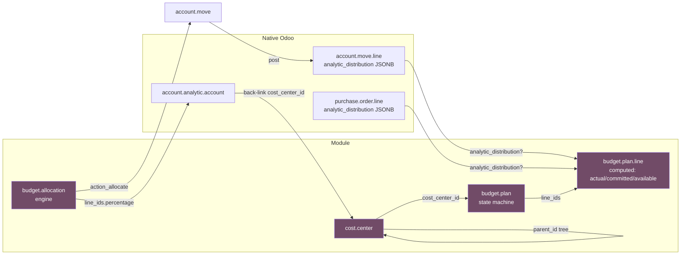
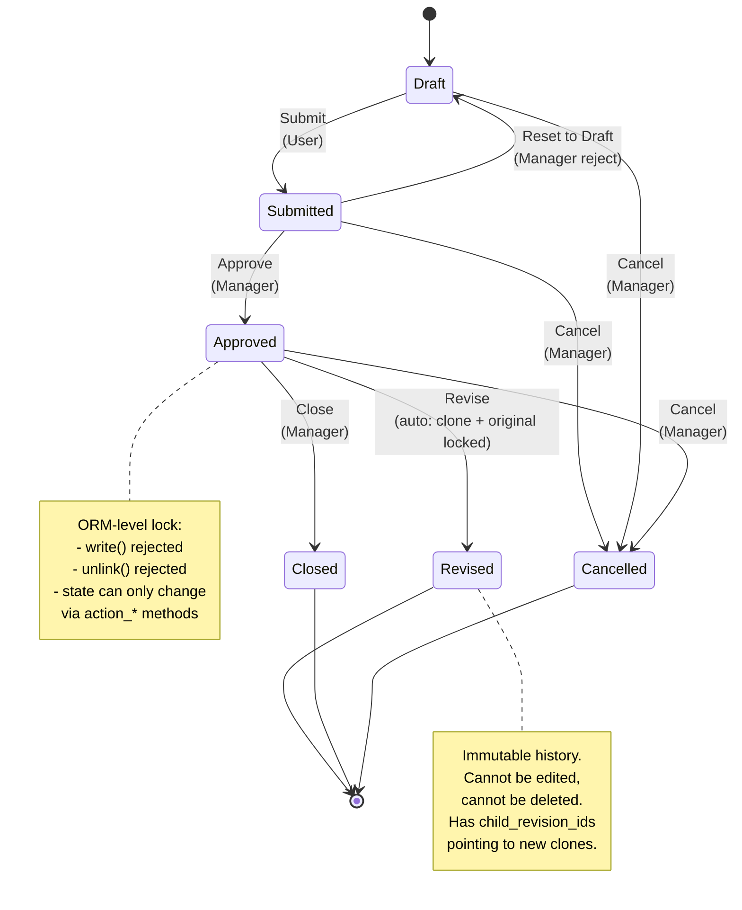
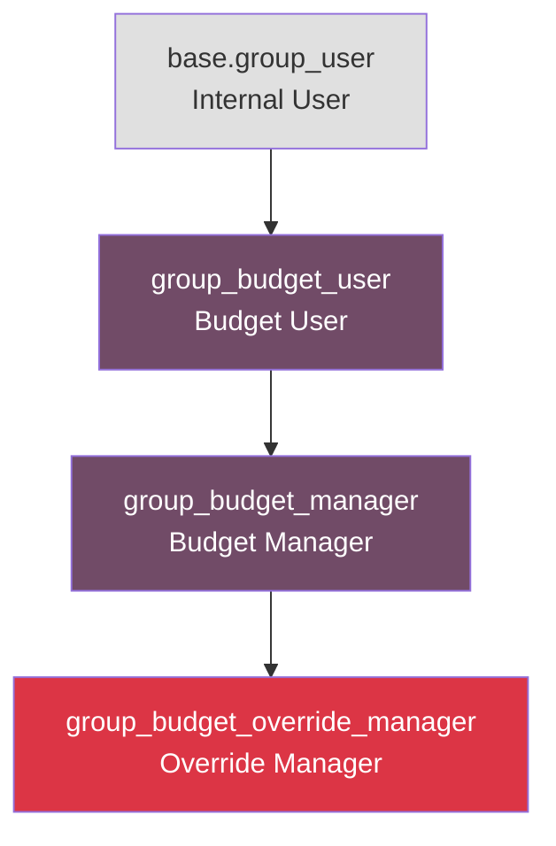

# Architecture Documentation

> **Audience**: Senior Odoo developers, OCA reviewers, code reviewers, and
> future maintainers who need to understand the design decisions and
> extension points of this module.
>
> **Last updated**: 2026-06-04

This document describes the internal architecture of the **Cost Center &
Budget Control** module for Odoo 18 CE. It complements the README by
explaining *why* design decisions were made, not just *what* the module
does.

---

## 1. Data Flow

The module connects three native Odoo subsystems (analytic, accounting,
purchase) with a new governance layer (cost center + budget plan +
allocation).



### Key Design Choice: Why a Separate `cost.center` Model?

Vanilla Odoo 18 provides `account.analytic.account` for transaction
tagging. A senior reviewer might ask: *why not extend it instead of
creating a new `cost.center` model?*

**Answer: Single Responsibility Principle.**

| Concern | Owner in Vanilla Odoo | Owner in This Module |
|---|---|---|
| Transaction tagging (1 transaction = 1 analytic) | `account.analytic.account` | `account.analytic.account` (unchanged) |
| Org structure (parent-child, manager, code) | ❌ (no native equivalent) | `cost.center` |
| Budget definition per org unit | ❌ | `budget.plan` |
| Budget enforcement (block at posting) | ❌ | `_validate_budget_control` |

We **bridge** the two via a new field `cost.center_id` on
`account.analytic.account` (`models/account_analytic.py`). This is
forward-only: existing `account.analytic.account` users can opt-in by
linking their records to a `cost.center`.

---

## 2. State Machine — Budget Plan



### ORM-Level State Protection (Critical Detail)

The state machine is **not just UI**. It's enforced at three layers:

1. **Form view** (`views/budget_plan_views.xml`): buttons invisible by state
2. **`write()` override** (`models/budget_plan.py`): `PROTECTED_STATES` set
   rejects modification when `state in (approved, revised, closed, cancelled)`
3. **`unlink()` override**: rejects deletion when `state in (submitted,
   approved, closed, cancelled)`

This is the **defense in depth** approach — UI hides the action, but even
direct ORM access via XML-RPC/API respects the state.

---

## 3. Security Model — 3-Tier Group Hierarchy



| Group | Can Do | Cannot Do |
|---|---|---|
| **Budget User** | Create cost center, budget plan, allocation. Submit plan. View all. | Approve, override block, delete finalized record, modify submitted plan |
| **Budget Manager** | All User + Approve, Reset, Close, Cancel, Revise, delete non-finalized | Override hard-block on posting |
| **Override Manager** | All Manager + **Override hard-block** on JE/PO, receive scheduled activity for blocked transactions | (no further restriction) |

### Why Group-Based, Not Context-Based

A common Odoo anti-pattern is `with_context(budget_override=True)` to
bypass validation. This is dangerous because:

1. Context can be set by **any client code** (including compromised
   third-party modules)
2. No audit trail — context is invisible
3. Trivially exploited by malicious actors

This module uses **group membership** for override authorization:
`_is_budget_override_allowed()` returns
`user.has_group('cost_center_budget_control.group_budget_override_manager')`.
Group membership:

1. Requires admin action to grant
2. Logged in chatter when used
3. Visible in user form for auditing
4. Required for `_validate_budget_control` bypass

---

## 4. Extension Points

The module is designed to be extended without forking. Common extensions:

### 4.1 Add a Custom Cost Center Hierarchy Level

```python
class CustomCostCenter(models.Model):
    _inherit = "cost.center"

    region_id = fields.Many2one("custom.region", string="Region")
    # parent_id tree still works; Odoo stores full path in parent_path
```

The `_parent_store=True` mechanism handles arbitrary depth. Just add
fields; no need to modify the tree.

### 4.2 Add a Custom Override Condition

```python
class CustomBudgetPlan(models.Model):
    _inherit = "budget.plan"

    def _is_budget_override_allowed(self):
        return (
            super()._is_budget_override_allowed()
            or self.env.user.has_group("custom_module.group_cfo")
        )
```

`super()._is_budget_override_allowed()` returns the standard
group-based check; your extension adds an additional path.

### 4.3 Extend the Allocation Engine

```python
class CustomAllocation(models.Model):
    _inherit = "budget.allocation"

    def compute_allocation(self):
        res = super().compute_allocation()
        # Add custom logic: e.g., apply tax adjustment per target
        return res
```

The allocation pipeline is a sequence of overridable methods:
`compute_allocation()` → `build_journal_lines()` → `create_move()` →
`post_move()`. Each can be extended or replaced.

### 4.4 Add a New Computed Field to Budget Plan Line

```python
class CustomBudgetPlanLine(models.Model):
    _inherit = "budget.plan.line"

    custom_metric = fields.Float(
        string="Custom Metric",
        compute="_compute_custom_metric",
    )

    def _compute_custom_metric(self):
        for line in self:
            line.custom_metric = line.actual_amount * 0.1  # example
```

Add `@api.depends` if the field should be recomputed automatically.

---

## 5. Performance Design Rationale

### 5.1 Why SQL JSONB + GIN Index, Not ORM `.search()`?

Computing `actual_amount` for 1,000 budget plan lines could naively be:

```python
# ❌ Don't do this (N+1)
for line in budget_lines:
    line.actual_amount = sum(
        move_line.balance
        for move_line in account_move_line.search([
            ("account_id", "=", line.account_id.id),
            ("analytic_distribution", "=", {str(analytic_id): 100.0}),
            ("date", ">=", line.plan_id.date_from),
            ("date", "<=", line.plan_id.date_to),
        ])
    )
```

This triggers 1,000+ queries. For 1,000 lines × 1,000 JE lines, you get
1M+ Python iterations. **Disaster.**

Instead, this module uses:

```sql
SELECT aml.account_id, SUM(aml.balance) AS total
FROM account_move_line aml
WHERE aml.parent_state = 'posted'
  AND aml.company_id = %s
  AND aml.date >= %s
  AND aml.date <= %s
  AND aml.analytic_distribution ? %s
GROUP BY aml.account_id
```

This is **1 query** for all 1,000 lines. The `analytic_distribution ?`
operator uses the GIN index installed by `post_init_hook` (see
`models/post_init_sql.py`).

### 5.2 Why Savepoint for PO Committed Compute?

`_compute_committed_amount` runs a SQL query on `purchase_order_line`.
If that query fails (e.g., `purchase` module not installed, table
missing, schema race), the transaction is poisoned. The next code line
that tries any DB operation (e.g., reading
`rec.currency_id.decimal_places`) fails with
`InFailedSqlTransaction`.

The fix in `models/budget_plan.py:653-660`:

```python
try:
    with rec.env.cr.savepoint():
        rec.env.cr.execute(sql_po, params_po)
        po_committed = rec.env.cr.fetchone()[0] or 0.0
except Exception:
    po_committed = 0.0
```

The savepoint auto-rolls-back on failure, isolating the error to this
one line. Subsequent code can still access `rec.currency_id` and other
fields without poisoning.

### 5.3 Why ORM-Level State Protection, Not View-Level?

UI-level state protection (making fields `invisible` in form view) is
**insufficient** because:

1. Direct ORM calls (XML-RPC, JSON-RPC, controllers) bypass view
2. Programmatic `record.write({...})` works regardless of view
3. State field itself can be modified directly

The `write()` and `unlink()` overrides in `models/budget_plan.py`
provide a **backend guarantee** that survives any UI change.

### 5.4 Why Batch Invalidate for PO Hooks?

`purchase.order` recompute is triggered by 5 events:
`button_confirm`, `button_cancel`, `action_rfq_send`, `write`,
`unlink`. Each collects impacted budget lines via
`_get_impacted_budget_lines_from_po_line()` (returns set of
`budget.plan.line` records), then calls
`_recompute_actual_amount_batch()` (invalidate cache, retrigger
all 6 stored computes).

This is O(impacted_lines), not O(all_lines). For a PO with 3 lines
matching 2 budget plan lines, we recompute 2 lines, not 100.

---

## 6. Module Boundaries

What this module **does** (and is well-tested for):

- Budget enforcement on journal entry posting
- Budget enforcement on purchase order confirmation (opt-in)
- PO committed amount tracking
- Overhead allocation engine
- Budget revision chain
- Multi-company isolation
- State machine governance

What this module **does not do** (and is not designed for):

- **Revenue forecasting** (use `mis_builder` or dedicated forecasting
  module)
- **Cash flow management** (use Odoo's bank statement + reconciliation)
- **Multi-year budget roll-over** (use `account.budget.recurring`)
- **Project-based budget** (use `project` module's analytic integration)
- **Customer invoice budget control** (out of scope; can be added via
  inheritance of `account.move` with `move_type='out_invoice'`)

---

## 7. Testing Strategy

The module has 4 test files in `tests/`:

| File | Focus | Test Count |
|---|---|---|
| `test_allocation_cost_center.py` | Allocation engine + cost center CRUD | 8 |
| `test_committed_amount.py` | PO committed tracking + threshold block | 9 |
| `test_budget_revision.py` | Revise workflow + state protection | 9 |
| (planned) `test_performance.py` | Benchmarks for 1K+ records | TBD |
| (planned) `test_multi_company.py` | Multi-company isolation | TBD |

**Pattern**: All tests use `TransactionCase` (rolls back per test) and
`@tagged("post_install", "-at_install")` to ensure test data is
isolated.

---

## 8. Maintenance Notes

### 8.1 Odoo Version Compatibility

| Odoo Version | Status | Notes |
|---|---|---|
| 18.0 | ✅ Active | Current development |
| 17.0 | ❌ Not supported | Uses `account_analytic_distribution` JSONB (v16+); `_parent_store` is Odoo 18-stable |
| 16.0 | ❌ Not supported | `analytic_distribution` is v16+; older v15 has separate `analytic_account_id` field |

### 8.2 Migration to Future Odoo Versions

When migrating to Odoo 19+:

1. Update `__manifest__.py` version to `19.0.x.x.x`
2. Check `account.move.line` API changes (rare; mostly stable)
3. Check `analytic_distribution` API (was `analytic_account_id` before
   v16)
4. Re-run benchmark tests; GIN index design should still apply

### 8.3 Known Performance Bottlenecks (Future Optimization)

For very large datasets (>10K budget plans), consider:

- **Materialized view** for cross-cost-center aggregation
- **Cron job** for batch recompute during off-peak hours
- **Caching** of `is_currently_active` (currently computed on read)
- **Partitioning** of `account_move_line` by date (PostgreSQL native)

These are NOT implemented because typical deployments (10-100 cost
centers) don't need them. Document here for future scale.

---

## 9. Glossary

| Term | Definition |
|---|---|
| **Analytic Distribution** | JSONB field on `account.move.line` mapping analytic account IDs to percentage weights |
| **Committed Amount** | `actual_amount + po_committed_amount` (mirrors Odoo 18 Enterprise "Committed" column) |
| **Available Amount** | `planned_amount - committed_amount`; negative = over-committed |
| **Override Manager** | Highest-tier security group; can bypass hard-block on posting |
| **Revision Chain** | Sequence of `budget.plan` records linked via `parent_revision_id`; original marked `revised` (immutable) |
| **Idempotency** | SHA1 fingerprint of allocation parameters ensures re-allocation reuses existing move |
| **Post-Init Hook** | Python code in `models/post_init_sql.py` that runs after `module.install()`; used to install GIN index |
| **GIN Index** | Generalized Inverted Index; PostgreSQL index type optimized for JSONB containment queries (`?`, `@>`, `<@`) |
